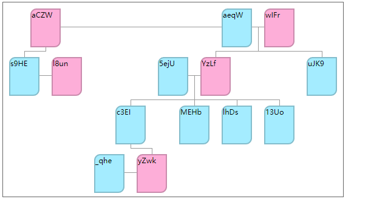
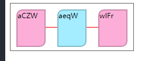
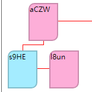
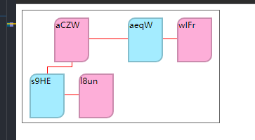

# 前言

在公司业务中，有一个核心需求，根据现实的家庭关系，宗族关系，实现一颗关系树。刚拿到这个需求真的是两眼一抹黑，可以想象如果子辈多一个人，那么父级节点的位置就要移动。不管用什么去实现难度都相当大，正在我一筹莫展的时候，
我发现了一个库

[relatives-tree](https://github.com/SanichKotikov/relatives-tree)

看他描述

> A tiny library (~3.5 kB gz) for calculating specific JSON data to family tree nodes and connectors.
> The nodes & the connectors are simple JS objects, so you can use any rendering layer.

基于`json`实现的一个有节点和连接器的js对象，所以你能用任何方式渲染它。

简直`nice`啊，这正是我需要的，看他的`demo`效果非常好，完全支持我实现公司自定义的业务，并且能在微信小程序端很好的展现。如果只是去使用，那也太简单了，当项目结束，我更好奇它是如何实现的，这也是我接下来要探索的东西。

## 展示中的门道

先来看他的一个`demo`



结合他的实现，可以发现，容器宽高是通过库计算得到的，所有节点的位置和连线都是，只有节点本身的宽高是使用者需要自定义的。继续观察他的`html`，有意思的是每个节点其实是相连的，只是他取巧的用内层块去展示内容，这样间距就不需要计算了，大大节省了计算量。

先将库最终的计算结果打印出来看看, 就以上面截图的`json`为例。

```js
import calcTree from 'relatives-tree';

const tree = calcTree(json, { rootId });
console.log(tree)
```

拿到以下数据

```js
{
  canvas: {},
  connectors: [],
  families: [],
  nodes: []
}
```

`canvas`就放着容器的宽高，`connectors`放着每条线该怎么画，`nodes`应该就是存放节点的位置。`families`对使用者来说没什么用，但其实在源码中是另外三个的核心，它存放着每一个小家庭。

这里先要明确一点，根据他给的`demo`库计算得到的数字，都是节点宽高一半的倍数，为何这么设计？想想一个最简单的一胎家庭，`parents`存在两个节点，`children`只有一个，那么`chilren`为了好看就会移动到`parents`两个节点的中间，也就是`x`会移动一半。那么以一半为倍数，也是为了方便计算。

好，了解了这些再来看看`families`中一个对象的数据包含哪些

```js
{
  id, 
  type, // root | child
  main, // true | false
  Y: 0, // 距离top的距离
  X: 0, // 距离left的距离
  parents: [], // 父级node存放
  children: [], // 子级node存放
  pid, // parentFamily id
}
```

这也就是上面说的每一个小家庭对象，根据上面图片，我们可以看到它有5个小家庭，第一个是`root`最为特殊，他没有父级，这符合家庭树的概念，总有一个祖宗。然后每一个具有母子/父子关系的都是一个小家庭，显而易见了。关键我们要清楚如何计算每个小家庭的`X`和`Y`

### 家庭的位置

家庭的对象的创建很有意思，主要来看看对于`children`的处理。

```js
export const createChildUnitsFunc = (store) => {
    const getSpouseNodes = getSpouseNodesFunc(store);
    return (familyId, child) => {
        const { left, middle, right } = getSpouseNodes([child]);
        return [...toArray(left), middle, ...toArray(right)]
            .map((nodes) => newUnit(familyId, nodes, true));
    };
};
```

通过`getSpouseNodes`拿到左中右3个值，这里不贴源码了直接说结果，`left`里面是男方结婚但是离婚或者亡故的，当然如果是古代，代指小老婆也没问题。`middle`里面放置两个人男女婚姻正常状态的，`right`放置女方的上一段婚姻关系。
这样正常的下一代关系就确立了。最后给每个`node`执行`newUnit`，这个对象主要关注`pos`属性。后面我们要记录偏移量，这个偏移量主要针对小家庭内部，`middle`相对于`left`， `right`相对于`middle`。来看一个最简单的



`middle`相对于`left`的`pos`就是`2`。上面说过标准单位是宽度的一半，这里`2`其实就是距离左侧`2*width/2`，就是`width`符合定义。

处理好`root`节点，再来看看每一个`child`节点是怎么处理的，这里需要看看源码

```js
const getUnitsWithChildren = (family) => (family.children.filter(hasChildren).reverse());
export const inChildDirection = (store) => {
    const createFamily = createFamilyFunc(store);
    const updateFamily = updateFamilyFunc(store);
    const arrangeFamilies = arrangeFamiliesFunc(store);
    store.familiesArray
        .filter(withType(FamilyType.root))
        .forEach((rootFamily) => {
        let stack = getUnitsWithChildren(rootFamily);
        while (stack.length) {
            const parentUnit = stack.pop();
            const family = createFamily(nodeIds(parentUnit), FamilyType.child);
            updateFamily(family, parentUnit);
            arrangeFamilies(family);
            store.families.set(family.id, family);
            stack = stack.concat(getUnitsWithChildren(family));
        }
    });
    return store;
};
```

`getUnitsWithChildren`方法将选出存在子节点并反转，也就是从左侧开始计算，这是合理的。因为左侧的值会改变右侧的值。`createFamily(nodeIds(parentUnit), FamilyType.child);`该方法重走一边上面的过程，但是这时候他是`child`节点。

在`createFamily`方法中和`root`节点不同的是，它存在父节点，我们来看下面这个图片



子级的`nodeCount`要比父级大，所以父级节点是要进行偏移的，也就是`diff`的作用。在这个创建的`family`中，`parents`下父节点的`pos`为`1`。

下面来看两个核心方法

```js
updateFamily(family, parentUnit);
arrangeFamilies(family);
```

先看这个`updateFamily`，入参`family`是创建出来的`child`节点，`parentUnit`是`root`节点下的左侧单元，也就是图片中的`aczw`。该方法主要更新`family`的位置，通过父级的`parentUnit`。

`arrangeFamiliesFunc`通过子级的`family`去循环计算父级的位置。还是以下面例子为例



```js
export const arrangeFamiliesFunc = (store) => ((family) => {
    let right = 0;
    while (family.pid) {
        right = Math.max(right, rightOf(family));
        const nextFamily = store.getFamily(family.pid);
        arrangeNextFamily(family, nextFamily, right);
        arrangeParentsIn(nextFamily);
        if (!nextFamily.pid)
            arrangeMiddleFamilies(store.rootFamilies, nextFamily.id, rightOf(nextFamily));
        family = nextFamily;
    }
});
```

这个方法还是看一下源码，`right`这个值就是`family`这个节点对于右边来说占据的位置，取的最大值，可以看到是`4`。
`arrangeNextFamily`干了些啥我们主要看，当有了子节点后的改变。`left`和`middle`的位置都变了。一个是`1`一个是`3`，也就是`middle`的`pos`变成了`3`。

最后判断如果`pid`还存在，就会继续循环，也就是继续改动父级的父级位置。之后就会循环`stack`，流程是一样的。注意这个循环是深度遍历，从右侧到左侧。非常合理。

以上我们就可以总结`family`节点（小家庭）和每个单元节点(left, middle, right)上数据的关系

这里再次看看他的数据结构

```js
family {
  id, 
  type, // root | child
  main, // true | false
  Y: 0, // 距离top的距离
  X: 0, // 距离left的距离
  parents: [], // 父级node存放
  children: [
    {unit}, // left
    {unit}, // middle
    {unit} // right
  ], // 子级node存放
  pid, // parentFamily id
}
unit {
  fid,
  child: isChild,
  nodes: [...nodes],
  pos: 0,
}
```

`SIZE`是常量为`2`，即相当于一个节点的大小

1. 单元中的`pos`值，比如middle通过`left.pos+nodeCount(left)*SIZE`计算得到
2. 通过一个`family`中`children`和`parent`的`diff`设置`parents`中`pos`的值
3. 更新`family`节点中`x,y`的值，通过`parent`节点
4. 核心方法`arrangeFamiliesFunc`
   1. 计算该`family`下距离右边的最大距离，`family.x+max((unit.post+nodeCount(parent), (unit.post+nodeCount(children)))`
   2. `arrangeNextFamily`方法得到父`family`的`X`，并更新`family`中`middle`下`pos`的值

大致流程就是这样，细节上还有很多，主要就是计算完一个`child`需要重复计算它上面的`parent`直到`root`节点

## 计算每个node的位置

这里我们回过头来看整个库的入口

```js
export default (nodes, options) => {
  const store = new Store(nodes, options.rootId)
  if (options.placeholders) placeholders(store)
  const families = calcFamilies(store).familiesArray
  return {
    families: families,
    canvas: getCanvasSize(families),
    nodes: getExtendedNodes(families),
    connectors: connectors(families)
  }
}
```

通过`getExtendedNodes`方法，确定每个`node`的位置，这里我们关注它的核心实现

```js
const extendNode = (family) => (
  (unit) => (
    unit.nodes.map((node, idx) => ({
      ...node,
      top: family.Y + (unit.child && !!family.parents.length ? SIZE : 0),
      left: getUnitX(family, unit) + (idx * SIZE),
      hasSubTree: hasHiddenRelatives(family, node),
    }))
  )
);
```

通过小家庭的`X,Y`的值，`X, Y`的值上面说过就是小家庭本身距离左侧和顶部的值，每个`unit`的定位通过
`x+unit.pos`就能得到。这里注意下`idx * SIZE`，他其实就是加上了右侧的缺失。比如`middle`为两个右侧的就需要加1，`hasSubTree`是和主树不相关的子树，不用去考虑。

`top`的计算只要知道一点，在小家庭中如果是子`family`并且存在`parents`就表明他需要增加`SIZE`的高度

## 计算连接器

这块的难度也非常大，源码重构后也很复杂，如果有兴趣可单步调试看看。这里只总结，看下面代码

```js
const toConnectors = (families) => (fn) => fn(families);
export const connectors = (families) => ([parents, middle, children].map(toConnectors(families)).flat());
```

在这里`parents, middle, children`是在三个方法，前两个处理的都是根节点和`parent`相关的代码，先略过不看，主要是看`children`的处理，它分为以下几步

1. 父母到子女，处理那条竖线
2. 孩子到父母，这块会保存一个值是用来画水平线进行孩子和父母的链接
   1. 儿童上方的水平，也就是链接父母子女
3. `unit`是夫妻的情况，这种只要中间连线
4. 孩子与孩子的配偶之间，也就是说存在离婚情况的。

这样对这个库也算初步了解了。很复杂，不过水平真的很高。关键还是每个小家庭的计算，和对于整个结构取巧的处理，使得整个计算量大减。
