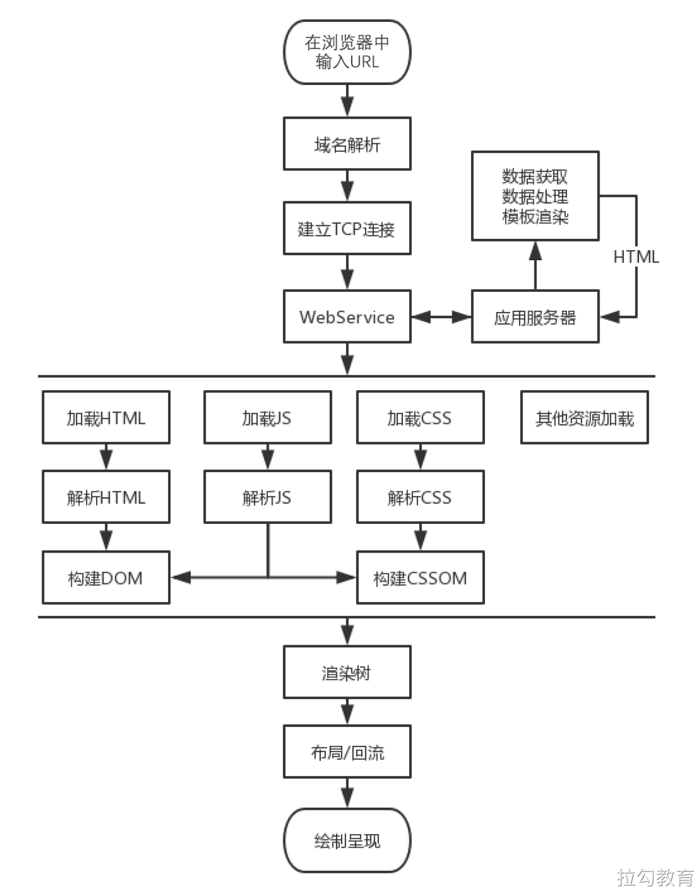

# 前端性能优化

## 什么是web性能

web性能是网站或者网站应用程序的客观度量和可感知的用户体验

- 减少整体加载时间：减少文件体积、减少http请求、使用预加载
- 使网站尽快可用：仅加载首屏内容、其他内容根据需要懒加载
- 平滑和交互性：使用css替代js动画、减少ui重绘
- 感知表现：给用户作用反馈，比如加载动画、进度条等
- 性能测定：性能指标、性能测试、性能监控持续优化

## 为什么要关注网站性能

- 用户留存
- 网站转化率
- 体验与传播
- 搜索排名

## 如何进行 web 性能优化

1. 首先了解性能指标，多快才算快
2. 使用专业工具评估网站性能
3. 然后立足于网站渲染流程，分析造成的原因
4. 进行技术可行性分析
5. 迭代优化

### 性能指标

[web vitals](https://web.dev/vitals/)
[web score权重](https://googlechrome.github.io/lighthouse/scorecalc/)

2020年google提出的侧重于用户体验的三个方面 **加载性能、交互性、视觉稳定性**三个方面
并提供了以下阈值

- First Contentful Paint (FCP): 首**次绘制内容，浏览器首次绘制来自dom的内容的时间**，这里只要显示内容了，就算绘制完成
- Largest Contentful Paint (LCP)：**最大内容绘制**，测量加载性能，LCP应在页面首次开始加载后的2.5s内发生
- First Input Delay (FID)：**首次输入延迟，测量交互性**。页面的fid应为100毫秒或更短
- Time to Interactive (TTI): 表示网页第一次达到**完全可交互状态**的时间点，浏览器已经可以持续性的响应用户输入
- Total Blocking Time (TBT): 总阻塞时间，度量 FCP 和 TTI 之间的总时间，即用户操作后到相应之间的时间
- Cumulative Layout Shift (CLS)：**积累布局偏倚，测量视觉稳定性**。页面的cls应保持在0.1或者更少

### 渲染流程

从我们打开地址栏输入url到整个页面渲染出来。整个过程包括域名解析、建立TCP连接，前后端通过HTTP进行会话，压缩与解压缩。以及前端的关键路径渲染。加载流程图如下所示

**优化方案**

从上图中就能看出在那些方面是可优化的

- 从发出请求到收到响应的优化，比如DNS查询，http长连接、http2、http压缩、http缓存等
- 关键路径渲染优化，比如是否存在不必要的重绘和回流
- 加载过程优化，比如延迟加载，是否有不需要在首屏展示的非关键信息，占用了加载时间
- 资源优化，图片视频
- 构建优化，压缩代码，基于webpack的构建优化

## web vitals

web vitals是google经过验证后新提出的来衡量网站性能的方式。且LCP和ClS（相关layout instability API）已于今年入W3C草拟标准

测量工具：
- [web-vitals库](https://github.com/GoogleChrome/web-vitals)
- 测试工具 lightouse
- 浏览器插件 [web-vitials](https://chrome.google.com/webstore/detail/web-vitals/ahfhijdlegdabablpippeagghigmibma)

## web 性能测试

在展开介绍性能检测方法和工具之前，我们需要破除一些错误认知

- **不要通过单一指标就能衡量网站的性能体验**，要多维度的思考整个网站的性能表现
- **不要一次检测就能得到网站性能表现的客观结果**，网站性能在不同设备不同网络环境下是可变的，需要我们手机尽可能多的数据，然后以此来进行性能分析
- **不要仅在开发环境中模拟进行性能检测**

### 常见检测工具

- lighthouse 开发工具
- webPageTest
- 浏览器devtools
  - 浏览器任务管理器
  - netWork面板
  - coverage 面板
  - memory面板
  - performance面板
  - performance monitor 面板
- 性能监控API
- 持续性能监控方案

## chrome devtools

### 浏览器任务管理器

通过chrom任务管理器可以插件进程中，关于GPU、网络和内存空间的使用情况。

### network 网络分析

通过它可以查看网站所有资源的请求情况，包括加载时间，尺寸大小，优先级设置一级http缓存触发情况等信息。从而帮助我们发现由于未压缩或者后台返回不及时导致的请求问题，或者资源尺寸过大问题，或者未合理配置缓存策略导致的二次请求过长问题

### coverage 面板

**我们可以通过Coverage面板监控并统计出网站应用运行过程中代码执行的覆盖率情况。**，该面板统计的对象是javascript脚本文件与css样式表文件，统计结果主要包括
- 每个文件字节大小
- 执行过程中已覆盖的代码字节数
- 以及可视化的覆盖率图形

这里我们可以看见那里包含比较多的不执行代码，而使用webpack的tree shaking 仅能根据export 进行无关联引用，那么此时coverage 面板就为优化提供了一条可以尝试的路径

### memory 面板

前端主要使用js代码来处理逻辑，所以保证代码执行过程中内存的良性循环对用户体验来说很重要，如果出现内存泄漏，那么就可能会带来网站应用卡顿或者崩溃。这时通过**memory**生成堆内存快照，就能查看出现内存泄漏的换届，进行解决

### performance 面板

面板使用非常简单，需要注意的是：建议在chrome浏览器的匿名模式下使用该工具，因为在匿名模式下不会受到既有缓存或者其他插件的因素的影响，能够给性能检测提供一个相对干净的运行环境

### performance monitor 

performance 存在面板信息不够直观，数据实时性不够强等问题，后来chrome 增加了 实时监控的面板，通过 devtools 里运行命令打开监控页面，通过他让我们可以实时监控网站运行过程中，cpu占有率，js内存使用大小、内存中dom节点的数量，js事件监听次数，以及页面发生重绘和重排的处理时间等信息

据此如果发现页面中出现较为陡峭的增长 就意味着可能有影响性能的风险存在