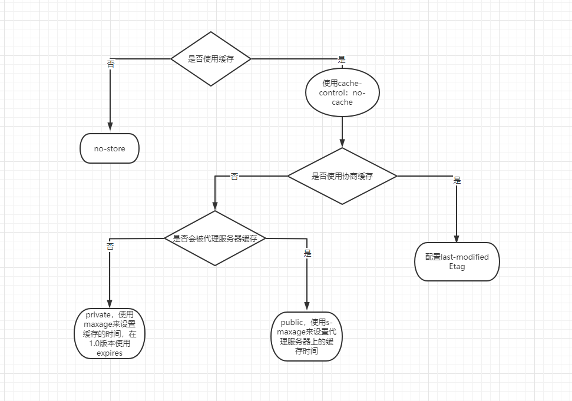

# 请求和响应优化

核心思路

1. 更好的链接传输效率
2. 更少的请求数量
3. 更小的资源大小
4. 合适的缓存策略

最佳实践

1. 减少DNS查找
2. 重用tcp链接
3. 减少http重定向
4. 压缩资源传输
5. 使用缓存
6. 使用cdn
7. 删除没必要的资源请求
8. 在客户端缓存资源
9. 内容在传输前先压缩
10. 并行处理请求和响应
11. 升级到http2.0
12. 服务端渲染
13. 采用预渲染的方式加快加载静态页面

## dns 解析

**dns-prefetch** 是尝试在请求资源之前解析域名，域名解析和内容加载是串行的网络，所以这个方式能介绍用户等待时间

使用cdn加速域名，这块在服务端尤其重要，因为cdn一般多个地点配置服务器，离用户越近越好

## http长连接

在http1.0时期，为了不频繁的建立和断开连接，有些浏览器在请求时，用了一个非标准的字段

```
Connection: keep-alive
```
这个字段要求服务器不要关闭连接

半年后http1.1发布引入了持久连接，即tcp默认不关闭，可以被多个请求复用。不用申明字段

但是这还是有个问题，客户端发送请求后需要等待服务端响应，才能发起下一个请求。
因此1.1还引入的**管道机制**，这样用户可以并行的发起多个请求，不用等待
一个tcp连接可以传送多个回应，势必要有一个机制来区分属于哪个回应，这就是`content-Length`的作用，用来申明本次回应的数据长度

但是这还是有个问题，对于耗时很长的操作，服务端需要等所有操作完成，才能发送数据。因此1.1引入了’分块传输代码‘，只要在请求或回应头中具有`Transfer-Encoding`字段，就表明回应将由数量未定的数据块组成

### 长连接的缺点

虽然允许复用tcp连接，但是在同一个tcp连接里面，所有数据通信是按次序进行的。服务器只有处理完一个回应才会进行下一个回应，这就会导致排队等候。这称之为“队头堵塞”

## http/2

### 二进制协议

在 1.1中头信息是文本，而2则是一个彻底的二进制协议。二进制的好处是，可以定义额外的帧，并且解析方便

### 多工

2里的复用tcp连接，客户端和服务端都可以同时发送多个请求和回应，而且不用按照顺序一一对应，这样就避免的队头堵塞

这样双向的、实时的通信就叫多工

### 数据流

2中的数据包不是按顺序发送的，所以2给每一个数据包（数据流）做了一个独一无二的编号，客户端还能指定数据流的优先级，优先级越高，越早响应

### 头信息压缩

http中很多字段是重复的，且需要每次发送。所以2就做了一点优化，引入了头信息压缩机制。一方面可以通过gzip压缩后发送；另一方面前后端还同时维护一张头信息表，通过索引来获取内容加快获取速度

### 服务器推送

2允许服务器未经请求，主动向客户端发送资源，这叫服务器推送。

## 避免重定向

重定向是由服务器发送特殊的响应而触发的，在http中定义的响应码位3xx，在一般使用中大多数重定向为登录。我们不看影响，来看看三种重定向

- 永久重定向 301 308
- 临时重定向 302 303 307
- 特殊重定向 300 304（常用，资源未被修改，使用了缓存）


## 压缩传输的数据资源

- 响应数据压缩 ：gzip

## HTTP 缓存



http缓存是最常结束的缓存之一，它可细分为m**强制缓存**和**协商缓存**，二者最大的区别在于判断缓存命中时，浏览器是否需要向服务器端进行询问来判断是否需要重新请求

### 强制缓存

和强制缓存有关的两个字段是`expires`he`cache-control`，在1.0时期会通过比较本地时间和`expires`来确定是否需要重新请求，但是这种方式存在一个很大的漏洞，如果用户对本地时间进行修改，那么对于缓存的判断就是会失误

所以在1.1时期新增了`cache-control`字段，只要设置`maxage=1000`来进行时间长度的控制，就能避免时间不同造成的问题

**no-cache、no-store**

no-store 表示完全使用最新数据，不使用缓存
no-cache 表示通过与服务器协商验证缓存有效性，若未过期，则使用本地缓存

**private、public**

public 表示响应资源即可以被浏览器缓存，也可以被代理期缓存
private 响应资源只能被浏览器缓存，若未显示指定啧默认为prite

**max-age、s-maxage**

s-maxage 表示缓存在代理服服务器上的有效性，当设置了public后，就可以设置它
且一般他会和max-age一起使用，这样来保证资源的有效性

### 协商缓存

**last-modifed**

顾名思义，协商缓存就是在使用本地缓存之前，需要向服务器发起一次GET请求，与之协商当前浏览器保存的本地缓存是否已经过期

首先再使用写上缓存之前，服务端会将`cache-control`设置为`no-cache`，然后获取文件的最后修改时间，放到响应头的`last-modified`中，客户端拿到后，入伙刷新页面，就会在请求头重带上一个`if-modified-since`字段，值和`last-modified`一样，这时候服务端比较两个值，后返回新资源，还是返回304不修改，将响应体重定向到本地缓存上

last-modifed的不足：

1. 获取时间戳其文件的修改单位是秒，如果文件修改非常快，这个缓存就存在有效性问题
2. 只改文件名，没动内容也会更新时间

**Etag**

为了弥补不足，1.1新增了`Etag`，`Etag`会根据文件内容的不同生成一个hash字符串。`Etag`比`last-modified`的优先级更高，做法和之前类似，客户端也会返回一个同值的`if-none-match`来给服务端进行判断

Etag的不足

1. 需要服务器消耗资源进行hash计算

## cdn 缓存

cdn为什么设计成和主站域名不同？

1. 避免对静态资源的请求携带不必要的Cookie信息
2. 考虑浏览器对同一域名下并发请求的限制