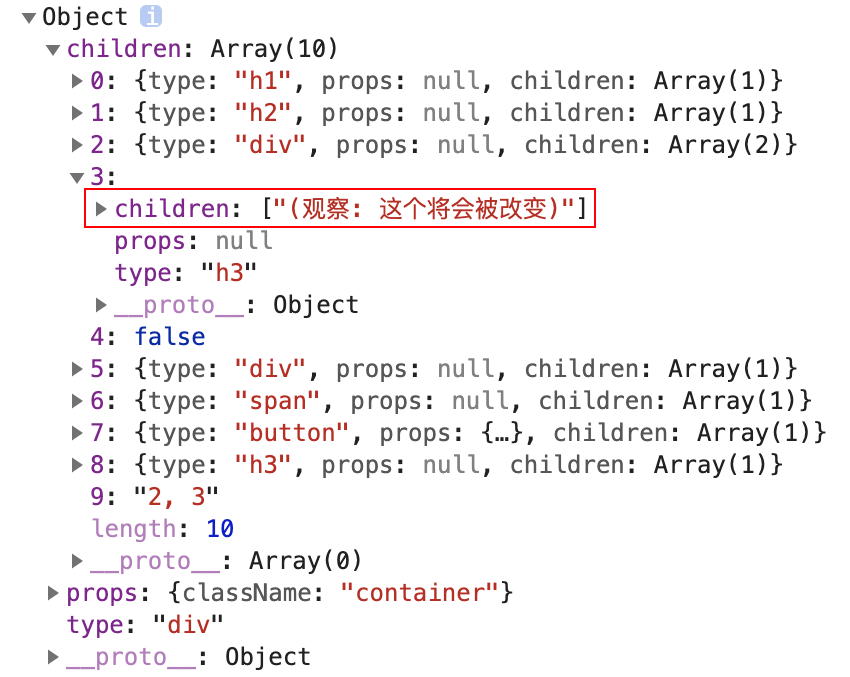

# TinyReact

从创建一个微小的 react 来了解`virtualDOM`的的渲染流程。所有的代码可以在
[这里](https://github.com/idenet/tiny-react)可以看到，`master`是所有实现，`init`是未实现的`tempalte`

**注意**
在`babelrc`中有一段代码，将`react`预置转换成了我们需要的`TinyReact`

```
[
  "@babel/preset-react",
   {
      "pragma": "TinyReact.createElement"
   }
]
```
这样我们就能拿到`react`转换后的js代码，到我们自己的`TinyReact`

## 创建 virtualDOM

在 TinyReact 文件夹中创建
``` js
// createElement.js
/**
 * 创建 Virtual DOM
 * @param {string} type 类型
 * @param {object | null} props 属性
 * @param  {createElement[]} children 子元素
 * @return {object} Virtual DOM
 */
function createElement (type, props, ...children) {
	return {
    type,
    props,
    children
  } 
}
```
在出口中导出 createElment.js
```js
// index.js
import createElement from './createElement'

export default {
  createElement,
}
```
在入口 `index.js`中使用代码

```js
import TinyReact from './TinyReact'

const virtualDOM = (
  <div className="container">
    <h1>你好 Tiny React</h1>
    <h2>(编码必杀技)</h2>
    <div>
      嵌套1 <div>嵌套 1.1</div>
    </div>
    <h3>(观察: 这个将会被改变)</h3>
    {2 == 1 && <div>如果2和1相等渲染当前内容</div>}
    {2 == 2 && <div>2</div>}
    <span>这是一段内容</span>
    <button onClick={() => alert('你好')}>点击我</button>
    <h3>这个将会被删除</h3>
    2, 3
  </div>
)
TinyReact(virtualDOM, root)
```
这里就拿到了`react`创建的`virtaulDOM`对象，但是通过以上代码我们发现 VDOM 存在一些问题，
第一个问题是文本节点北直街放到了数组中，第二个问题是排除布尔值和null的节点, 第三点props可以拿到children



但是我们希望文本节点也是放在对象中的，所以我们需要对 createElement 进行改造

```js
export default function createElement(type, props, ...children) {
  // 由于 map 方法无法从数据中刨除元素, 所以此处将 map 方法更改为 reduce 方法
  const childElements = [].concat(...children).reduce((result, child) => {
     // 判断子元素类型 刨除 null true false
    if (child !== false && child !== true && child !== null) {
      // 判断 child 是否是对象类型
      if (child instanceof Object) {
        result.push(child)
      } else {
        result.push(createElement('text', { textContent: child }))
      }
    }
    // 将需要保留的 Virtual DOM 放入 result 数组
    return result
  }, [])
  return {
    type,
    props: Object.assign({ children: childElements }, props),
    children: childElements,
  }
}
```

## 将 vDOM 转换成 真实 DOM

导出一个 render 函数，用来实现真实 dom

```js
import createElement from './createElement'
import render from './render'

export default {
  createElement,
  render,
}
```
入口代码更改

```js
import TinyReact from './TinyReact'

const root = document.getElementById('root')

const virtualDOM = (
  <div className="container">
    <h1>你好 Tiny React</h1>
    <h2>(编码必杀技)</h2>
    <div>
      嵌套1 <div>嵌套 1.1</div>
    </div>
    <h3>(观察: 这个将会被改变)</h3>
    {2 == 1 && <div>如果2和1相等渲染当前内容</div>}
    {2 == 2 && <div>2</div>}
    <span>这是一段内容</span>
    <button onClick={() => alert('你好')}>点击我</button>
    <h3>这个将会被删除</h3>
    2, 3
  </div>
)

TinyReact.render(virtualDOM, root)
// react渲染完成后的vdom 类似
{
  type: "div",
  props: { className: "container" },
  children: [
    {
      type: "h3",
      props: null,
      children: [
        {
          type: "text",
          props: {
            textContent: "Hello React"
          }
        }
      ]
    },
    {
      type: "p",
      props: null,
      children: [
        {
          type: "text",
          props: {
            textContent: "React is great"
          }
        }
      ]
    }
  ]
}
```
render 函数的实现。他接收 VDOM，根节点，oldDOM(用于之后的比对)

```js
// render.js
export default function render(virtualDOM, container, oldDOM) {
  // 在 diff 方法内部判断是否需要对比 对比也好 不对比也好 都在 diff 方法中进行操作  
  diff(virtualDOM, container, oldDOM)
}
```
```js
// diff.js
import mountElement from "./mountElement"

export default function diff(virtualDOM, container, oldDOM) {
  // 判断 oldDOM 是否存在
  if (!oldDOM) {
    // 如果不存在 不需要对比 直接将 Virtual DOM 转换为真实 DOM
    mountElement(virtualDOM, container)
  }
}
```
这里我们还要处理他是否是vDOM，还是组件，所以我们还需要一个函数来判断

```js
// mountElement.js
import mountNativeElement from "./mountNativeElement"

export default function mountElement(virtualDOM, container) {
  // 通过调用 mountNativeElement 方法转换 Native Element
  mountNativeElement(virtualDOM, container)
}
```
```js
// mountNativeElement.js
import createDOMElement from "./createDOMElement"

export default function mountNativeElement(virtualDOM, container) {
  const newElement = createDOMElement(virtualDOM)
  container.appendChild(newElement)
}
```
在我们创建完节点之后，其实他的属性并没有添加到节点之上，我们需要一个函数来将属性，value等添加到上面
```js
// createDOMElement.js
import mountElement from "./mountElement"
import updateNodeElement from "./updateNodeElement"

export default function createDOMElement(virtualDOM) {
  let newElement = null
  if (virtualDOM.type === "text") {
    // 创建文本节点
    newElement = document.createTextNode(virtualDOM.props.textContent)
  } else {
    // 创建元素节点
    newElement = document.createElement(virtualDOM.type)
    // 更新元素属性
    updateNodeElement(newElement, virtualDOM)
  }
  // 递归渲染子节点
  virtualDOM.children.forEach(child => {
    // 因为不确定子元素是 NativeElement 还是 Component 所以调用 mountElement 方法进行确定
    mountElement(child, newElement)
  })
  return newElement
}
```

### 给元素节点添加属性

```js
// updateNodeElement.js
export default function updateNodeElement(newElment, virtualDOM) {
  // 获取节点对应的属性对象
  const newProps = virtualDOM.props
  Object.keys(newProps).forEach((propName) => {
    const newPropsValue = newProps[propName]
    // 判断属性是否是事件属性 onClick -> click
    if (propName.slice(0, 2) === 'on') {
      // 事件名称
      const eventName = propName.toLocaleLowerCase().slice(2)
      // 为元素添加事件
      newElment.addEventListener(eventName, newPropsValue)
      // 如果属性名称是 value 或者 checked 需要通过 [] 的形式添加
    } else if (propName === 'value' || propName === 'checked') {
      newElment[propName] = newPropsValue
    } else if (propName !== 'children') {
       // className 属性单独处理 不直接在元素上添加 class 属性是因为 class 是 JavaScript 中的关键字
      if (propName === 'className') {
        newElment.setAttribute('class', newPropsValue)
      } else {
        // 设置普通属性
        newElment.setAttribute(propName, newPropsValue)
      }
    }
  })
}

```

## 渲染组件

### 函数组件

替换入口渲染位函数组件
```js
function Demo() {
  return <div>hello</div>
}

const Heart = () => <Demo></Demo>

TinyReact.render(<Heart></Heart>, root)

// 组件的 Virtual DOM
{
  type: f function() {},
  props: {}
  children: []
}

```


在渲染组件时，要先将 Component 与 Native Element 区分开，如果是 Native Element 可以直接开始渲染，如果是组件，特别处理。

```js{6-11}
import mountNativeElment from './mountNativeElement'
import isFunction from './isFunction'
import mountComponent from './mountComponent'

export default function mountElement(virtualDOM, container) {
  // 无论是类组件还是函数组件 其实本质上都是函数 
  // 如果 Virtual DOM 的 type 属性值为函数 就说明当前这个 Virtual DOM 为组件
  if (isFunction(virtualDOM)) {
    // Component
    mountComponent(virtualDOM, container)
  } else {
    // Component vs MativeElment
    mountNativeElment(virtualDOM, container)
  }
}

// Virtual DOM 是否为函数类型
export default function isFunction(virtualDOM) {
  return virtualDOM && typeof virtualDOM.type === 'function'
}
```
在 mountComponent 方法中再进行函数组件和类型的区分，然后再分别进行处理。

```js
// mountComponent.js
import mountNativeElement from "./mountNativeElement"

export default function mountComponent(virtualDOM, container) {
  // 存放组件调用后返回的 vdom 的容器
  let nextVirtualDOM = null
  // 区分函数型组件和类组件
  if (isFunctionalComponent(virtualDOM)) {
    // 函数组件 调用 buildFunctionalComponent 方法处理函数组件
    nextVirtualDOM = buildFunctionalComponent(virtualDOM)
  } else {
    //TODO 类组件
  }
  // 判断得到的 vdom 是否是组件
  if (isFunction(nextVirtualDOM)) {
    // 如果是组件 继续调用 mountComponent 解剖组件
    mountComponent(nextVirtualDOM, container)
  } else {
    // 如果是 Navtive Element 就去渲染
    mountNativeElement(nextVirtualDOM, container)
  }
}

// vdom 是否为函数型组件
// 条件有两个: 1. vdom 的 type 属性值为函数 2. 函数的原型对象中不能有render方法
// 只有类组件的原型对象中有render方法 
export function isFunctionalComponent(virtualDOM) {
  const type = virtualDOM && virtualDOM.type
  return (
    type && isFunction(virtualDOM) && !(type.prototype && type.prototype.render)
  )
}

// 函数组件处理 
function buildFunctionalComponent(virtualDOM) {
  // 通过 vdom 中的 type 属性获取到组件函数并调用
  // 调用组件函数时将 vdom 对象中的 props 属性传递给组件函数 这样在组件中就可以通过 props 属性获取数据了
  // 组件返回要渲染的 vdom
  return virtualDOM && virtualDOM.type(virtualDOM.props || {})
}
```

这样函数组件就处理完成了。这里注意如果函数组件中有函数组件，他的先后调用顺序是什么?
我们注意这段代码，在正常的走到渲染真实dom的时候，我们会递归调用 children ，在这里，调用了
`mountElement`, 在`mountElement`中，继续判断了`Vdom`是组件还是虚拟dom

``` js
// 递归渲染子节点
virtualDOM.children.forEach(child => {
  // 因为不确定子元素是 NativeElement 还是 Component 所以调用 mountElement 方法进行确定
  mountElement(child, newElement)
})
```

### 渲染类组件

类组件本身也是VDOM，可以通过 VDOM中的type来确定当前是类组件还是函数组件
在确定是类组件后，通过实例化组件调用组件中的render方法，获取需要渲染的VOM。
类组件继承自 Component 父类，子类通过super方法将自身的props属性传递给父类，父类将props属性挂载为父类属性，这样子类也具有了
props属性。这么做的好处是，当props发生更新后，父类可以根据更新后的props帮助子类更新视图

假设以下代码就是我们要渲染的类组件：

```js
class Alert extends TinyReact.Component {
  constructor(props) {
    // 将 props 传递给父类 子类继承父类的 props 子类自然就有 props 数据了
    // 否则 props 仅仅是 constructor 函数的参数而已
    // 将 props 传递给父类的好处是 当 props 发生更改时 父类可以帮助更新 props 更新组件视图
    super(props)
  }
  render() {
    return (
      <div>
        <p>{this.props.message}</p>
      </div>
    )
  }
}

TinyReact.render(<Alert message="Hello React" />, root)
```
在出口处导出 Component

```js
import createElement from './createElement'
import render from './render'
import Component from './Component'

export default {
  createElement,
  render,
  Component,
}
```
在 mountComponent中判断是类组件还是函数组件，通过其分别调用函数处理

```js{5-11}
// mountComponent.js
export default function mountComponent(virtualDOM, container) {
  let nextVirtualDOM = null
  // 区分函数型组件和类组件
  if (isFunctionalComponent(virtualDOM)) {
    // 函数组件
    nextVirtualDOM = buildFunctionalComponent(virtualDOM)
  } else {
    // 类组件
    nextVirtualDOM = buildStatefulComponent(virtualDOM)
  }
  // 判断得到的 Virtual Dom 是否是组件
  if (isFunction(nextVirtualDOM)) {
    mountComponent(nextVirtualDOM, container)
  } else {
    mountNativeElement(nextVirtualDOM, container)
  }
}
// 处理类组件
function buildClassComponent(virtualDOM) {
  // 实例化class组件 传递props
  const component = new virtualDOM.type(virtualDOM.props || {})
  // 调用类组件中的render方法得到要渲染的 Virtual DOM
  const nextVirtualDOM = component.render()
  // 返回要渲染的 Virtual DOM
  return nextVirtualDOM
}
```
创建 Component 父类，赋值 props 属性，这样子类也能拿到了

```js
export default class Component {
  constructor(props) {
    this.props = props
  }
}
```


## VDOM 对比更新

在新旧dom树的对比过程中，如何拿到旧的dom是第一个问题？其实在页面上已经有了真实的dom对象，
那么可以给真实的dom对象添加一个属性，这个属性就是旧的VDOM，这样就能很容易的拿到了

```js
export default function createDomElelment(virtualDOM) {
  ...
  // 将 Virtual DOM 挂载到真实 DOM 对象的属性中 方便在对比时获取其 Virtual DOM
  newElment._virtualDOM = virtualDOM
  ...
}
```
然后在render函数中拿到oldDOM, 为什么是 container.firstChild, 因为每一个组件都有一个父亲节点，
出口就是`<div id="app"></div>`，它也是一个父亲节点，所以其第一个元素就是`oldDOM`

```js
export default function render(
  virtualDOM,
  container,
  // 拿到第一个元素
  oldDOM = container.firstChild
) {
  diff(virtualDOM, container, oldDOM)
}
```

### vdom 是相同类型

判断 oldVirtualDOM 是否存在， 如果存在则继续判断要对比的 Virtual DOM 类型是否相同，
如果类型相同判断节点类型是否是文本，如果是文本节点对比，就调用 updateTextNode 方法；如果是元素节点就调用
updateNodeElement，这个方法其实就是更新元素的方法

```js
export default function diff(virtualDOM, container, oldDOM) {
  // 获取未更新前的 Virtual DOM
  const oldVirtualDOM = oldDOM && oldDOM._virtualDOM
  // 判断oldDOM 是否存在
  if (!oldDOM) {
    mountElement(virtualDOM, container)
    // 存在oldVdom，且两者类型相同
  } else if (oldVirtualDOM && virtualDOM.type === oldVirtualDOM.type) {
    if (virtualDOM.type === 'text') {
      // 更新内容 找到差异更新到真实dom oldDOM
      updateTextNode(virtualDOM, oldVirtualDOM, oldDOM)
    } else {
      // 更新元素属性
      updateNodeElement(oldDOM, virtualDOM, oldVirtualDOM)
    }
    // 循环子元素，将子元素进行更新
    virtualDOM.children.forEach((child, i) => {
      diff(child, oldDOM, oldDOM.childNodes[i])
    })
  }
}

```
updateTextNode 方法用于对比文本节点内容是否发生变化，如果发生变化则更新真实 DOM 对象中的内容，既然真实 DOM 对象发生了变化，还要将最新的 Virtual DOM 同步给真实 DOM 对象。

```js
export default function updateTextNode(virtualDOM, oldVirtualDOM, oldDOM) {
  // 如果两者文本节点不相等
  if (virtualDOM.props.textContent !== oldVirtualDOM.props.textContent) {
    // 将虚拟dom的文本内容复制给真实dom
    oldDOM.textContent = virtualDOM.props.textContent
    // 同步真实dom对应的vdom
    oldDOM._virtualDOM = virtualDOM
  }
}

```
updateNodeElement 用于设置/更新元素节点属性
思路是
1. 先分别获取更新后的和更新前的 Virtual DOM 中的 props 属性，循环新 Virtual DOM 中的 props 属性，通过对比看一下新 Virtual DOM 中的属性值是否发生了变化，如果发生变化 需要将变化的值更新到真实 DOM 对象中

2. 再循环未更新前的 Virtual DOM 对象，通过对比看看新的 Virtual DOM 中是否有被删除的属性，如果存在删除的属性 需要将 DOM 对象中对应的属性也删除掉

```js
export default function updateNodeElement(
  newElment,
  virtualDOM,
  oldVirtualDOM = {}
) {
  //  获取节点对应的属性对象
  // 从新props中判断属性被添加的情况
  const newProps = virtualDOM.props
  const oldProps = oldVirtualDOM.props || {} // 首次渲染没有oldVirtaulDOM
  Object.keys(newProps).forEach((propName) => {
    // 获取属性值
    const newPropsValue = newProps[propName]
    const oldPropsValue = oldProps[propName]

    if (newPropsValue !== oldPropsValue) {
      // 判断属性是否是事件属性 onClick -> click
      if (propName.slice(0, 2) === 'on') {
        // 事件名称
        const eventName = propName.toLocaleLowerCase().slice(2)
        // 为元素添加事件
        newElment.addEventListener(eventName, newPropsValue)
        // 删除原有的事件的事件处理函数 同名
        if (oldPropsValue) {
          newElment.removeEventListener(eventName, oldPropsValue)
        }
      } else if (propName === 'value' || propName === 'checked') {
        newElment[propName] = newPropsValue
      } else if (propName !== 'children') {
        if (propName === 'className') {
          newElment.setAttribute('class', newPropsValue)
        } else {
          newElment.setAttribute(propName, newPropsValue)
        }
      }
    }
  })

  // 从oldProps中 判断属性被删除的情况
  Object.keys(oldProps).forEach((propName) => {
    const newPropsValue = newProps[propName]
    const oldPropsValue = oldProps[propName]
    if (!newPropsValue) {
      // 属性被删除了
      if (propName.slice(0, 2) === 'on') {
        const eventName = propName.toLocaleLowerCase().slice(2)
        newElment.removeEventListener(eventName, oldPropsValue)
      } else if (propName !== 'children') {
        newElment.removeAttribute(propName)
      }
    }
  })
}

```
节点更新使用的是深度优先的遍历顺序


### vdom是不同类型

当对比的元素节点类型不同时，就不需要继续对比了，直接使用新的 Virtual DOM 创建 DOM 对象，用新的 DOM 对象直接替换旧的 DOM 对象。当前这种情况要将组件刨除，组件要被单独处理。

```js
// diff.js
else if (
  // 如果 Virtual DOM 类型不一样
  virtualDOM.type !== oldVirtualDOM.type &&
  // 并且 Virtual DOM 不是组件 因为组件要单独进行处理
  typeof virtualDOM.type !== "function"
) {
  // 根据 Virtual DOM 创建真实 DOM 元素
  const newDOMElement = createDOMElement(virtualDOM)
  // 用创建出来的真实 DOM 元素 替换旧的 DOM 元素
  oldDOM.parentNode.replaceChild(newDOMElement, oldDOM)
} 
```

### 删除节点

删除节点发生在节点更新以后并且发生在同一个父节点下的所有子节点身上。

在节点更新完成以后，如果旧节点对象的数量多于新 VirtualDOM 节点的数量，就说明有节点需要被删除。


```js{17-24}
export default function diff(virtualDOM, container, oldDOM) {
  ...
  // 判断oldDOM 是否存在
  if (!oldDOM) {
    ...
  } else if (
    (virtualDOM.type !== oldVirtualDOM.type && typeof virtualDOM,
    type !== 'function')
  ) {
    ...
  } else if (oldVirtualDOM && virtualDOM.type === oldVirtualDOM.type) {
      ...
    // 删除节点
    // 获取旧节点
    let oldChildNodes = oldDOM.childNodes
    // 判断旧节点的数量
    if (oldChildNodes / length > virtualDOM.children.length) {
      // 有节点需要被删除
      for (
        let i = oldChildNodes.length - 1;
        i > virtualDOM.children.length - 1;
        i--
      ) {
        unmountNode(oldChildNodes[i])
      }
    }
  }
}
export default function unmountNode(node) {
  node.remove()
}
```

### 类组件状态更新

实现以下代码的功能，

```js
// index.js
class Alert extends TinyReact.Component {
  constructor(props) {
    super(props)
    this.state = {
      title: "default title"
    }
    // 更改 handleChange 方法中的 this 指向 让 this 指向类实例对象
    this.handleChange = this.handleChange.bind(this)
  }
  handleChange() {
    // 调用父类中的 setState 方法更改状态
    this.setState({
      title: "changed title"
    })
  }
  render() {
    return (
      <div>
        <h2>{this.state.title}</h2>
        <p>{this.props.message}</p>
        <button onClick={this.handleChange}>change title</button>
      </div>
    )
  }
}
```
setState 方法定义在父类中，该方法就是合并原有的state，产生新的state

```js
// Component.js
export default class Component {
  constructor(props) {
    this.props = props
  }
  setState (state) {
    // setState 方法被子类调用 此处this指向子类实例对象
    // 所以改变的是子类的 state 对象
    this.state = Object.assign({}, this.state, state)
  }
}
```
现在子类可以调用父类的setState方法更改状态，当组件的state状态发生改变时，要调用render方法更新视图
在组件更新之时，我们需要比对新旧vdom 找出要更新的部分，这里this指向的是子类，所以调用render 就能获得
vdom

```js
// Component.js
setState(state) {
  // setState 方法被子类调用 此处this指向子类
  // 所以改变的是子类的 state
  this.state = Object.assign({}, this.state, state)
  // 通过调用 render 方法获取最新的 Virtual DOM
  let virtualDOM = this.render()
}
```
在父类Component设置两个函数用来存储dom和获取dom，

```js
// Component.js
// 保存 DOM 对象的方法
setDOM(dom) {
  this._dom = dom
}
// 获取 DOM 对象的方法
getDOM() {
  return this._dom
}
```
接下来我们要研究如何调用到setDOM方法，首先我们必须要具有实例，有实例才能调用方法，在`buildClassComponent`方法
中我们初始化了实例，并返回给了`nextVirtualDOM`, 它又被传入了`mountNativeElment`， 在这里我们拿到了真实dom，从前面我们知道，
在真实dom中我们把虚拟dom赋值给了`newElement`,综上所述

```js
// mountComponent.js
function buildClassComponent(virtualDOM) {
  // 实例化class组件 传递props
  const component = new virtualDOM.type(virtualDOM.props || {})
  // 拿到render函数
  const nextVirtualDOM = component.render()
  // 将实例赋值给nextvirtualdom
  nextVirtualDOM.component = component
  return nextVirtualDOM
}
```
```js
// mountNativeElment.js
export default function mountNativeElment(virtualDOM, container) {
  let newElment = createDomElelment(virtualDOM)
  // 将转换之后的对象，放置到页面中·
  container.appendChild(newElment)

  // 获取实例对象
  let component = virtualDOM.component
  // 类组件存在
  if (component) {
    component.setDOM(newElment)
  }
}
```

现在更新前的 Virtual DOM 对象和更新后的 Virtual DOM 对象就都已经获取到了，接下来还要获取到真实 DOM 对象父级容器对象，最后调用diff就行了
```js
  setState(state) {
    this.state = Object.assign({}, this.state, state)
    // 获取最新的要渲染的 virtualDOM 对象
    let virtualDOM = this.render()
    // 获取旧的 virtualDOM对象，进行比对
    let oldDOM = this.getDOM()
    // 获取容器
    let container = oldDOM.parentNode
    // 实现对比
    diff(virtualDOM, container, oldDOM)
  }
```

### 组件更新

在 diff 方法中判断需要更新的 vdom 是不是组件，需要分多钟情况，新增 diffComponent 进行处理

```js
// diff.js
// 旧的组件的实例对象
const oldComponent = oldVirtualDOM && oldVirtualDOM.component
else if (typeof virtualDOM.type === "function") {
  // 要更新的是组件
  // 1) 组件本身的 virtualDOM 对象 通过它可以获取到组件最新的 props
  // 2) 要更新的组件的实例对象 通过它可以调用组件的生命周期函数 可以更新组件的 props 属性 可以获取到组件返回的最新的 Virtual DOM
  // 3) 要更新的 DOM 象 在更新组件时 需要在已有DOM对象的身上进行修改 实现DOM最小化操作 获取旧的 Virtual DOM 对象
  // 4) 如果要更新的组件和旧组件不是同一个组件 要直接将组件返回的 Virtual DOM 显示在页面中 此时需要 container 做为父级容器
  diffComponent(virtualDOM, oldComponent, oldDOM, container)
}
```
#### 不是同一个组件

 在 diffComponent 方法中判断需要更新的组件是不是同一个组件

```js
// diffComponent.js
export default function diffComponent(virtualDOM, oldComponent, oldDOM, container) {
  // 判断要更新的组件和未更新的组件是否是同一个组件 只需要确定两者使用的是否是同一个构造函数就可以了
  if (isSameComponent(virtualDOM, oldComponent)) {
    // 属同一个组件 做组件更新  
  } else {
    // 不是同一个组件 直接将组件内容显示在页面中
  }
}
// virtualDOM.type 更新后的组件构造函数
// oldComponent.constructor 未更新前的组件构造函数
// 两者等价就表示是同一组件
function isSameComponent(virtualDOM, oldComponent) {
  return oldComponent && virtualDOM.type === oldComponent.constructor
}
```
如果不是同一个组件，则只需要将组件显示到页面，并且删除原有的dom就行

```js
// diffComponent.js
else {
  // 不是同一个组件 直接将组件内容显示在页面中
  // 这里为 mountElement 方法新增了一个参数 oldDOM 
  // 作用是在将 DOM 对象插入到页面前 将页面中已存在的 DOM 对象删除 否则无论是旧DOM对象还是新DOM对象都会显示在页面中
  mountElement(virtualDOM, container, oldDOM)
}
```
在 mountNativeElement 方法中删除原有的dom对象

```js
// mountNavtiveElement.js
export default function mountNativeElement(virtualDOM, container, oldDOM) {
 // 如果旧的DOM对象存在 删除
  if (oldDOM) {
    unmount(oldDOM)
  }
}
export default function unmount(node) {
  node.remove()
}
```
#### 是同一个组件

如果是同一个组件的话，需要执行组件更新操作，需要调用组件生命周期函数

先在 Component 类中添加生命周期函数，子类要使用的话直接覆盖就可以

并添加 updateProps 方法 用于更新props

```js
// Component.js
export default class Component {
  updateProps(props) {
    this.props = props
  }
  // 生命周期函数
  componentWillMount() {}
  componentDidMount() {}
  componentWillReceiveProps(nextProps) {}
  shouldComponentUpdate(nextProps, nextState) {
    return nextProps != this.props || nextState != this.state
  }
  componentWillUpdate(nextProps, nextState) {}
  componentDidUpdate(prevProps, preState) {}
  componentWillUnmount() {}
}
```

新建 updateComponent 方法用于更新组件的操作

```js
// diffComponent.js
if (isSameComponent(virtualDOM, oldComponent)) {
  // 属同一个组件 做组件更新
  updateComponent(virtualDOM, oldComponent, oldDOM, container)
}
```

在 updateComponent 方法中调用组件的生命周期函数，更新组件获取最新 Virtual DOM，最终调用 diff 方法进行更新

```js
import diff from "./diff"

export default function updateComponent(
  virtualDOM,
  oldComponent,
  oldDOM,
  container
) {
  // 生命周期函数
  oldComponent.componentWillReceiveProps(virtualDOM.props)
  if (
    // 调用 shouldComponentUpdate 生命周期函数判断是否要执行更新操作
    oldComponent.shouldComponentUpdate(virtualDOM.props)
  ) {
    // 将未更新的 props 保存一份
    let prevProps = oldComponent.props
    // 生命周期函数
    oldComponent.componentWillUpdate(virtualDOM.props)
    // 更新组件的 props 属性
    oldComponent.updateProps(virtualDOM.props)
    // 因为组件的 props 已经更新 所以调用 render 方法获取最新的 Virtual DOM
    const nextVirtualDOM = oldComponent.render()
    // 进行一系列操作后 将组件实例对象挂载到 Virtual DOM 身上
    nextVirtualDOM.component = oldComponent
    // 调用diff方法更新视图
    diff(nextVirtualDOM, container, oldDOM)
    // 生命周期函数
    oldComponent.componentDidUpdate(prevProps)
  }
}
```
## ref 属性

为节点添加 ref 属性可以获取到这个节点的 DOM 对象，比如在 DemoRef 类中，为 input 元素添加了 ref 属性，目的是获取 input DOM 元素对象，在点击按钮时获取用户在文本框中输入的内容

```js
// index.js
class DemoRef extends TinyReact.Component {
  handle() {
    let value = this.input.value
    console.log(value)
  }
  render() {
    return (
      <div>
        <input type="text" ref={input => (this.input = input)} />
        <button onClick={this.handle.bind(this)}>按钮</button>
      </div>
    )
  }
}
```

实现思路是在创建节点时判断其 Virtual DOM 对象中是否有 ref 属性，如果有就调用 ref 属性中所存储的方法并且将创建出来的DOM对象作为参数传递给 ref 方法，
这样在渲染组件节点的时候就可以拿到元素对象并将元素对象存储为组件属性了。

```js
// createDOMElement.js
if (virtualDOM.props && virtualDOM.props.ref) {
  virtualDOM.props.ref(newElement)
}
```

在类组件的身上也可以添加 ref 属性，目的是获取组件的实例对象，比如下列代码中，在 DemoRef 组件中渲染了 Alert 组件，在 Alert 组件中添加了 ref 属性，
目的是在 DemoRef 组件中获取 Alert 组件实例对象。

```js
class DemoRef extends TinyReact.Component {
  handle() {
    let value = this.input.value
    console.log(value)
    console.log(this.alert)
  }
  componentDidMount() {
    console.log("componentDidMount")
  }
  render() {
    return (
      <div>
        <input type="text" ref={input => (this.input = input)} />
        <button onClick={this.handle.bind(this)}>按钮</button>
        <Alert ref={alert => (this.alert = alert)} />
      </div>
    )
  }
}
```

实现思路是在 mountComponent 方法中，如果判断了当前处理的是类组件，就通过类组件返回的 Virtual DOM 对象中获取组件实例对象，
判断组件实例对象中的 props 属性中是否存在 ref 属性，如果存在就调用 ref 方法并且将组件实例对象传递给 ref 方法。

```js
// mountComponent.js
let component = null
  if (isFunctionalComponent(virtualDOM)) {}
	else {
    // 类组件
    nextVirtualDOM = buildStatefulComponent(virtualDOM)
    // 获取组件实例对象
    component = nextVirtualDOM.component
  }
	// 如果组件实例对象存在的话
	if (component) {
    // 组件完成挂载的生命周期函数
      component.componentDidMount()
   	// 判断组件实例对象身上是否有 props 属性 props 属性中是否有 ref 属性
    if (component.props && component.props.ref) {
      // 调用 ref 方法并传递组件实例对象
      component.props.ref(component)
    }
  }

```

## key 属性

在 React 中，一般会给循环渲染添加 key 属性，key属性帮助 React 快速更新数据和删除数据，从而达到 DOM 操作最小化的目的

### key 属性节点对比

在两个元素进行对比时， 循环旧 dom 对象的子元素，将有key属性的族元素存储到一个对象中，借着循环新的vdom对象的子元素，在循环中获取这个子元素的key属性，
然后用这个key属性找到对应 对象中的 是否有这个元素，如果能找到 说明已存在，不需要渲染；如果找不到，说明需要新增

```js
// diff.js
else if (oldVirtualDOM && virtualDOM.type === oldVirtualDOM.type) {
  // 将拥有key属性的元素放入 keyedElements 对象中
  let keyedElements = {}
  for (let i = 0, len = oldDOM.childNodes.length; i < len; i++) {
    let domElement = oldDOM.childNodes[i]
    if (domElement.nodeType === 1) {
      let key = domElement.getAttribute("key")
      if (key) {
        keyedElements[key] = domElement
      }
    }
  }
}
```

```js
// diff.js
// 看一看是否有找到了拥有 key 属性的元素
let hasNoKey = Object.keys(keyedElements).length === 0

// 如果没有找到拥有 key 属性的元素 就按照索引进行比较
if (hasNoKey) {
  // 没有 递归对比 Virtual DOM 的子元素
  virtualDOM.children.forEach((child, i) => {
    diff(child, oldDOM, oldDOM.childNodes[i])
  })
} else {
  // 使用key属性进行元素比较
  virtualDOM.children.forEach((child, i) => {
    // 获取要进行比对的元素的 key 属性
    let key = child.props.key
    // 如果 key 属性存在
    if (key) {
      // 到已存在的 DOM 元素对象中查找对应的 DOM 元素
      let domElement = keyedElements[key]
      // 如果找到元素就说明该元素已经存在 不需要重新渲染
      if (domElement) {
        // 虽然 DOM 元素不需要重新渲染 但是不能确定元素的位置就一定没有发生变化
        // 所以还要查看一下元素的位置
        // 看一下 oldDOM 对应的(i)子元素和 domElement 是否是同一个元素 如果不是就说明元素位置发生了变化
        if (oldDOM.childNodes[i] && oldDOM.childNodes[i] !== domElement) {
          // 元素位置发生了变化
          // 将 domElement 插入到当前元素位置的前面 oldDOM.childNodes[i] 就是当前位置
          // domElement 就被放入了当前位置
          oldDOM.insertBefore(domElement, oldDOM.childNodes[i])
        }
      } else {
        // 新增元素
        mountElement(child, oldDOM, oldDOM.childNodes[i])
      }
    }
  })
}
```
这里新增元素不是所有的都放到最后的，根据最后一个元素是否存在，判断是否是插入
```js
// mountNativeElement.js
if (oldDOM) {
  container.insertBefore(newElement, oldDOM)
} else {
  // 将转换之后的DOM对象放置在页面中
  container.appendChild(newElement)
}
```

### 节点卸载

在比对节点的过程中，如果旧节点的数量多于要渲染的新节点的数量就说明有节点被删除了，
继续判断 keyedElements 对象中是否有元素，如果没有就使用索引方式删除，如果有就要使用 key 属性比对的方式进行删除。

```js
 // 删除节点
 // 获取旧节点
 let oldChildNodes = oldDOM.childNodes
 // 如果旧节点的数量多于要渲染的新节点的长度
 if (oldChildNodes.length > virtualDOM.children.length) {
   if (hasNoKey) {
     // 是否有key， 没有 普通删除
     for (
       let i = oldChildNodes.length - 1;
       i > virtualDOM.children.length - 1;
       i--
     ) {
       unmountNode(oldChildNodes[i])
     }
   } else {
     // 通过key属性删除节点
     for (let i = 0; i < oldChildNodes.length; i++) {
       let oldChild = oldChildNodes[i]
       let oldChildKey = oldChild._virtualDOM.props.key
       let found = false
       for (let n = 0; n < virtualDOM.children.length; n++) {
         if (oldChildKey === virtualDOM.children[n].props.key) {
           found = true
           break
         }
       }
       if (!found) {
         unmountNode(oldChild)
       }
     }
   }
 }
```

卸载节点并不是说将节点直接删除就可以了，还需要考虑以下几种情况

1. 如果要删除的节点是文本节点的话可以直接删除
2. 如果要删除的节点由组件生成，需要调用组件卸载生命周期函数
3. 如果要删除的节点中包含了其他组件生成的节点，需要调用其他组件的卸载生命周期函数
4. 如果要删除的节点身上有 ref 属性，还需要删除通过 ref 属性传递给组件的 DOM 节点对象
5. 如果要删除的节点身上有事件，需要删除事件对应的事件处理函数

```js
export default function unmount(dom) {
  // 获取节点对应的 virtualDOM 对象
  const virtualDOM = dom._virtualDOM
  // 如果要删除的节点时文本
  if (virtualDOM.type === "text") {
    // 直接删除节点
    dom.remove()
    // 阻止程序向下运行
    return
  }
  // 查看节点是否由组件生成
  let component = virtualDOM.component
  // 如果由组件生成
  if (component) {
    // 调用组件卸载生命周期函数
    component.componentWillUnmount()
  }
  
  // 如果节点具有 ref 属性 通过再次调用 ref 方法 将传递给组件的DOM对象删除
  if (virtualDOM.props && virtualDOM.props.ref) {
    virtualDOM.props.ref(null)
  }

  // 事件处理
  Object.keys(virtualDOM.props).forEach(propName => {
    if (propName.slice(0, 2) === "on") {
      const eventName = propName.toLowerCase().slice(2)
      const eventHandler = virtualDOM.props[propName]
      dom.removeEventListener(eventName, eventHandler)
    }
  })
	
  // 递归删除子节点
  if (dom.childNodes.length > 0) {
    for (let i = 0; i < dom.childNodes.length; i++) {
      unmount(dom.childNodes[i])
      i--
    }
  }
  	
  dom.remove()
}

```