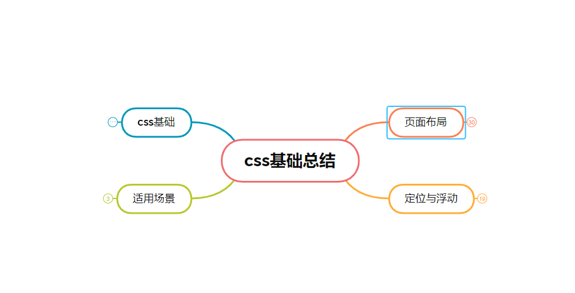

# css

这里方代码实现，如果想看基础总结，查看`xmind`文件夹下的`css`文件



## 两栏布局

一般来说是左边固定宽度，右边自适应

- 利用浮动和`margin-left`

```css
.outer {
  height: 100px;
}

.left {
  float: left;
  width: 200px;
  background-color: tomato;
}

.right {
  margin-left: 200px;
  width: auto;
  background-color: gainsboro;
}
```
- 左侧左浮动，右侧触发`bfc`，`bfc`元素不会重叠。

```css
.outer {
  height: 100px;
}

.left {
  float: left;
  width: 200px;
  background-color: tomato;
}

.right {
  width: auto;
  background-color: red;
  overflow: hidden;
}
```
- 使用`flex`布局

```css
.outer {
  height: 100px;
  display: flex;
}

.left {
  width: 200px;
  flex: 0 0 200px;
  background-color: tomato;
}

.right {
  flex: 1;
  background-color: red;
}
```

- 绝对定位

```css
.outer {
  position: relative;
  height: 100px;
}
.left {
  position: absolute;
  width: 200px;
  height: 100px;
  background: tomato;
}
.right {
  margin-left: 200px;
  background: gold;
}
```

## 三栏布局的实现

一般是左右固定，中间自适应的布局

- 利用绝对定位

```css
.outer {
  position: relative;
  height: 100px;
}

.left {
  position: absolute;
  width: 200px;
  height: 100px;
  background-color: tomato;
}

.right {
  position: absolute;
  top: 0;
  right: 0;
  width: 200px;
  height: 100px;
  background-color: yellowgreen;
}

.center {
  margin-left: 200px;
  margin-right: 200px;
  height: 100px;
  background-color: gold;
}
```

- `flex`布局

```css
.outer {
  height: 100px;
  display: flex;
}

.left {
  width: 200px;
  flex: 0 0 200px;
  height: 100px;
  background-color: tomato;
}

.right {
  flex: 0 0 200px;
  width: 200px;
  height: 100px;
  background-color: yellowgreen;
}

.center {
  flex: 1;
  height: 100px;
  background-color: gold;
}
```

- 圣杯布局 中间一列放在最前面

```css
.outer {
  height: 100px;
  padding-left: 100px;
  padding-right: 200px;
}

.left {
  position: relative;
  left: -100px;

  float: left;
  margin-left: -100%;

  width: 100px;
  height: 100px;
  background: tomato;
}

.right {
  position: relative;
  left: 200px;

  float: right;
  margin-left: -200px;

  width: 200px;
  height: 100px;
  background: gold;
}

.center {
  float: left;

  width: 100%;
  height: 100px;
  background: lightgreen;
}
```
- 双飞翼布局

```css
.outer {
  height: 100px;
}

.left {
  float: left;
  margin-left: -100%;

  width: 100px;
  height: 100px;
  background: tomato;
}

.right {
  float: left;
  margin-left: -200px;

  width: 200px;
  height: 100px;
  background: gold;
}

.wrapper {
  float: left;

  width: 100%;
  height: 100px;
  background: lightgreen;
}

.center {
  margin-left: 100px;
  margin-right: 200px;
  height: 100px;
}
```
- 使用`flex`实现`center`在最前面的三栏布局 推荐

```css{10}
.outer {
  height: 100px;
  display: flex;
}

.left {
  width: 200px;
  flex: 0 0 200px;
  height: 100px;
  order: -1;
  background-color: tomato;
}

.right {
  flex: 0 0 200px;
  width: 200px;
  height: 100px;
  background-color: yellowgreen;
}

.center {
  flex: 1;
  height: 100px;
  background-color: gold;
}
```

## 水平垂直居中

- 绝对定位，使用了`css3`属性

```css
.parent {
  position: relative;
}

.child {
  position: absolute;
  left: 50%;
  top: 50%;
  transform: translate(-50%,-50%);
}
```

- 绝对定位`margin`

```css
.parent {
  position: relative;
}

.child {
  position: absolute;
  top: 0;
  bottom: 0;
  left: 0;
  right: 0;
  margin: auto;
}
```

- 绝对定位，已知盒子

```css
.parent {
  position: relative;
}

.child {
  position: absolute;
  top: 50%;
  left: 50%;
  margin-top: -50px;     /* 自身 height 的一半 */
  margin-left: -50px;    /* 自身 width 的一半 */
}
```

- `flex` 现代浏览器基本不考虑`ie`，推荐使用

```css
.parent {
  display: flex;
  justify-content:center;
  align-items:center;
}
```

## 实现一个三角形

`border`是由四个三角形组成的，所以可以用来实现三角形

```css
div {
  width: 0;
  height: 0;
  border: 100px solid;
  border-color: orange blue red green;
}
/* 下三角形 */
div {
  width: 0;
  height: 0;
  border-top: 50px solid red;
  border-right: 50px solid transparent;
  border-left: 50px solid transparent;
}
```
## 实现一个扇形

```css
div {
  width: 0;
  height: 0;
  border: 100px solid transparent;
  border-radius: 100px;
  border-top-color: tomato;
}
```

## 如何解决1px问题

- 直接写，这样兼容性不行 在`ios`端是可以，`安卓`系统则不行

- 伪元素缩放，最常用的方法

```html
<div id="container" data-device={{window.devicePixelRatio}}></div>
```

```css
#container[data-device="2"] {
  position: relative;
}
#container[data-device="2"]::after{
    position:absolute;
    top: 0;
    left: 0;
    width: 200%;
    height: 200%;
    content:"";
    transform: scale(0.5);
    transform-origin: left top;
    box-sizing: border-box;
    border: 1px solid #333;
}
```