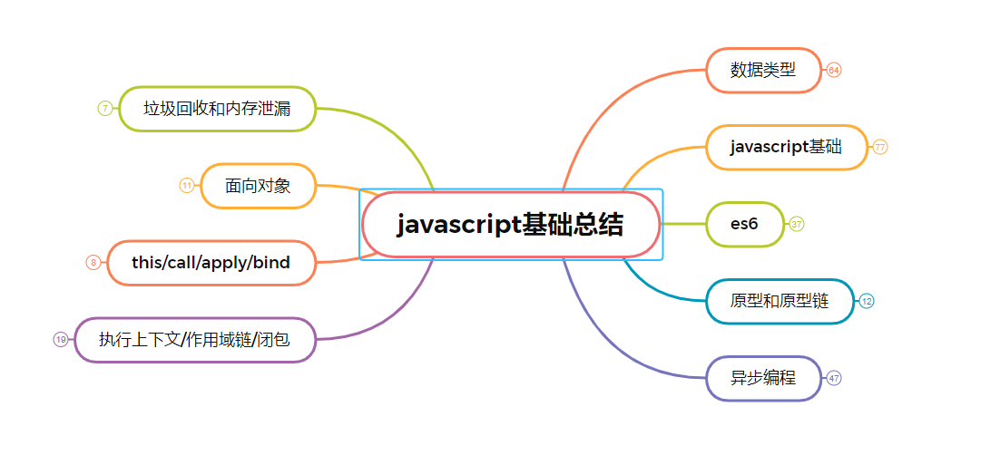

# js基础-各种手写的实现

如果想看基础总结，查看`xmind`文件夹下的`js`文件



## Object.create的实现

将创建的对象a的隐式原型指向传入的显示原型

```js
function create(obj) {
  function F() {}
  F.prototype = obj
  return new F()
}
```

## instanceof 的实现

右侧构造函数的`prototype`是否在左侧原型链中能够找到

```js
function myInstance (left, right) {
  // 获取左侧的隐式原型
  let proto = Object.getPrototypeOf(left)
  // 获取构造函数的显示原型
  let prototype = right.prototype
  while(true) {
    if(!proto) return false
    // 隐式原型=== 显示原型则表示在原型链上找到
    if(proto === prototype) return true
    proto = Object.getPrototypeOf(proto)
  }
}
```

## new 操作符实现原理

1. 使用`Object.create`创建一个空对象，并且隐式原型指向传入的显示原型
2. 使用`apply`执行构造函数和确定`this`指向
3. 返回空对象或者执行后拿到的对象

```js
function myNew(fn, ...rest) {
  let obj = Object.create(fn.prototype)
  let res = fn.apply(obj, ...rest)
  if(res && (typeof res ==='object'|| typeof res === 'function')) {
    return res
  }
  return obj
}
```

## 防抖函数实现

在n秒内触发事件后，如果再次触发会重新计算时间

```js
function debounce(fn, wait) {
  let timer = null
  return function() {
    args = arguments
    if(timer) {
      clearTimeout(timer)
      timer = null
    }
    timer = setTimeout(() => {
      fn.apply(this, args)
    }, wait);
  }
}
```

## 节流函数的实现

n秒内只会执行一次事件

```js
function throttle (fn, delay) {
  let flag = true
  return function () {
    let args = arguments
    if (!flag) return
    flag = false
    setTimeout(() => {
      fn.apply(this, args)
      flag = true
    }, delay)
  }
}
```

## call 和 apply的实现

`call`和`apply`实现是一样的，只是传入的参数一个是数组，一个是单个的

```js
Function.prototype.myCall = function(context, ...args) {
  if(!context || context === null) {
    context = window
  }
  let fn = Symbol()
  context[fn] = this
  return context[fn](...args)
}
```

## bind 实现

1. `bind`可以被`new`调用，调用后`this`指向当前实例
2. 返回的是一个函数

```js
Function.prototype.myBind = function(context, ...args) {
  if(!context || context === null) {
    context = window
  }
  let fn = Symbol()
  context[fn] = this
  let _this = this
  const result = function(...innerArgs) {
    // 说明是用new了 是 构造函数
    if(this instanceof _this) {
      this[fn] = _this // 重新赋值函数
      this[fn](...[...args, ...innerArgs])
    }else {
      // 如果是普通函数调用 this指向就是传入的context
      context[fn](...[...args, ...innerArgs])
    }
  }
  result.prototype = Object.create(this.prototype)
  return result
}
```

## 实现一个compose函数

用法如下

```js
function fn1 (x) {
  return x + 1
}
function fn2 (x) {
  return x + 2
}
function fn3 (x) {
  return x + 3
}
function fn4 (x) {
  return x + 4
}
const a = compose(fn1, fn2, fn3, fn4)

console.log(a(1)) // 1+4+3+2+1=11
```

实现

```js
function compose(...fn) {
  if(!fn.length) return v=>v
  if(fn.length === 1) return fn[0]
  return fn.reduce((pre, cur) => (...args) => pre(cur(...args)))
}
```

## 用 settimeout 模拟 setinterval

为什么要这么做？

在`setinterval`中，因为主线程执行时间不确定

1. 可能多个定时器会连续执行
2. 某些间隔可能会跳过

```js
function mySetinterval(fn, t) {
  let timer = null
  function interval() {
    fn()
    timer = setTimeout(interval, t);
  }
  interval()
  return {
    cancel: () => clearTimeout(timer)
  }
}
```

## 实现发布订阅模式

```js
class EventEmitter {
  constructor() {
    this.events = {}
  }
  on(type, callback) {
    if(!this.events[type]) {
      this.events[type] = [callback]
    } else {
      this.events[type].push(callback)
    }
  }
  emit(type, ...rest) {
    this.events[type] && this.events[type].forEach(fn => fn.apply(this, rest))
  }
  off(type, callback) {
    if(!this.events[type]) return
    this.events[type] = this.events[type].filter(item => item !== callback)
  }
  once(type, callback) {
    function fn() {
      callback()
      this.off(type, fn)
    }
    this.on(type, fn)
  }
}
```

## 数组去重

```js
function uniqueArr(arr) {
  return [...new Set(arr)]
}
```

## 数组扁平化

```js
function flatter(arr) {
  if(!arr.length) return 
  return arr.reduce((pre, cur) => (Array.isArray(cur) ? [...pre, flatter(cur)]: [...pre, cur]), [])
}
```

迭代的方法

```js
function flatter2(arr) {
  if(!arr.length) return
  if(arr.some(item => Array.isArray(item))) {
    arr = [].concat(...arr)
  }
  return arr
}
```

## es5 模拟 es6的 继承

```js
function Parent (name) {
  this.name = name
  this.say = () => {
    console.log(this.name)
  }
}

Parent.prototype.play = () => {
  console.log(222)
}
function Children (name) {
  Parent.call(this)
  this.name = name
}
Children.prototype = Object.create(Parent.prototype)
Children.prototype.constructor = Children
```

## 深拷贝

```js
function isObject(val) {
  return typeof val === 'object' && val !== null
}
function deepClone(obj, hash = new WeakMap()) {
  if(!isObject(obj)) return obj
  // 已存在
  if(hash.hah(obj)) {
    return hash.get(obj)
  }
  let target = Array.isArray(obj) ? [] : {}
  hash.set(obj, target)
  Reflect.ownKeys(obj).forEach(item => {
    if (isObject(obj[item])) {
      target[item] = deepClone(obj[item], hash)
    } else {
      target[item] = obj[item]
    }
  })
  return target
}
```

## 柯里化

柯里化实现，部分求值，吧接收多个参数的函数转变成接收一个参数的函数
用法如下：
const add = (a, b, c) => a + b + c;
const a = currying(add, 1);
console.log(a(2,3))

```js
function currying(fn, ...args) {
  const length = fn.length
  let allArgs = [...args]
  const res = (...newArgs) => {
    allArgs = [...allArgs, ...newArgs]
    if(allArgs.length === length) {
      return fn(...allArgs)
    } else {
      return res
    }
  }
  return res
}
```

升级版：add(1)(2)(3)...(n)

```js
function add(...args) {
  const func = add.bind(null, ...args) // bind 保存链式调用的参数
  func.toString = () => args.reduce((prev, cur) => (prev+=cur), 0) // ==会隐式转换 调用 toString
  return func
}
```

## 版本号排序

 有一组版本号如下['0.1.1', '2.3.3', '0.302.1', '4.2', '4.3.5', '4.3.4.5']。
 现在需要对其进行排序，排序的结果为
 ['4.3.5','4.3.4.5','2.3.3','0.302.1','0.1.1']

```js
arr.sort((a, b) => {
  let i = 0
  const arr1 = a.split('.')
  const arr2 = b.split('.')

  while (true) {
    const s1 = arr1[i]
    const s2 = arr2[i]
    i++
    if (s1 === undefined || s2 === undefined) {
      return arr2.length - arr1.length
    }
    if (s1 === s2) continue

    return s2 - s1
  }
})
```

## 列表转树形结构

[
    {
        id: 1,
        text: '节点1',
        parentId: 0 //这里用0表示为顶级节点
    },
    {
        id: 2,
        text: '节点1_1',
        parentId: 1 //通过这个字段来确定子父级
    }
    ...
]

转成
[
    {
        id: 1,
        text: '节点1',
        parentId: 0,
        children: [
            {
                id:2,
                text: '节点1_1',
                parentId:1
            }
        ]
    }
]

```js
function listToTree(data) {
  let temp = {}
  treeData = []
  for(let i=0;i<data.length;i++) {
    temp[data[i].id] = data[i]
  }
  for(let i in temp) {
    if(+temp[i].parentId != 0) {
      if(!temp[temp[i].parentId].children) {
        temp[temp[i].parentId].children = []
      }
      temp[temp[i].parentId].children.push(temp[i])
    }
    treeData.push(temp[i])
  }
  return treeData
}
```

```js
function treeToList(data) {
  let res = []
  const dfs = (tree) => {
    tree.forEach(item => {
      if(item.children) {
        dfs(item.children)
        delete item.children
      }
      res.push(item)
    })
  }
  dfs(data)
  return res
}
```

## ajax

```js
const SERVER_URL = "/server";
let xhr = new XMLHttpRequest();
// 创建 Http 请求
xhr.open("GET", url, true);
// 设置状态监听函数
xhr.onreadystatechange = function() {
  if (this.readyState !== 4) return;
  // 当请求成功时
  if (this.status === 200) {
    handle(this.response);
  } else {
    console.error(this.statusText);
  }
};
// 设置请求失败时的监听函数
xhr.onerror = function() {
  console.error(this.statusText);
};
// 设置请求头信息
xhr.responseType = "json";
xhr.setRequestHeader("Accept", "application/json");
// 发送 Http 请求
xhr.send(null);
```

## 原型修改、重写

```js
function Person(name) {
    this.name = name
}
// 修改原型
Person.prototype.getName = function() {}
var p = new Person('hello')
console.log(p.__proto__ === Person.prototype) // true
console.log(p.__proto__ === p.constructor.prototype) // true
// 重写原型
Person.prototype = {
    getName: function() {}
}
var p = new Person('hello')
console.log(p.__proto__ === Person.prototype)        // true
console.log(p.__proto__ === p.constructor.prototype) // false
```

下面`p`的原型被修改了，`p.constructor` 不指向`Person`。那么只要修改回来就好了

```js
Person.prototype = {
    getName: function() {}
}
var p = new Person('hello')
p.constructor = Person
console.log(p.__proto__ === Person.prototype)        // true
console.log(p.__proto__ === p.constructor.prototype) // true
```

## 原型链指向

**要牢记 `__proto__`是浏览器的实现，它是用来访问`prototype`的。**

```js
p.__proto__  // Person.prototype
Person.prototype.__proto__  // Object.prototype
p.__proto__.__proto__ //Object.prototype
p.__proto__.constructor.prototype.__proto__ // Object.prototype
Person.prototype.constructor.prototype.__proto__ // Object.prototype
p1.__proto__.constructor // Person
Person.prototype.constructor  // Person
```

## 如何获得对象非原型链上的属性？

```js
function iterate(obj){
  var res=[];
  for(var key in obj){
      if(obj.hasOwnProperty(key))
          res.push(key+': '+obj[key]);
  }
  return res;
} 
```

## 继承的几种方式

- 原型链继承

缺点: 无法实现多继承

```js
//父类型
function Person(name, age) {
   this.name = name,
   this.age = age,
   this.play = [1, 2, 3]
   this.setName = function () { }
}
Person.prototype.setAge = function () { }
//子类型
function Student(price) {
   this.price = price
   this.setScore = function () { }
}
Student.prototype = new Person() // 子类型的原型为父类型的一个实例对象
var s1 = new Student(15000)
var s2 = new Student(14000)
console.log(s1,s2)
```

- 借用构造函数继承

缺点：无法继承原型上的方法

```js
function Person(name, age) {
  this.name = name,
  this.age = age,
  this.setName = function () {}
}
Person.prototype.setAge = function () {}
function Student(name, age, price) {
  Person.call(this, name, age)  // 相当于: this.Person(name, age)
  this.price = price
}
var s1 = new Student('Tom', 20, 15000)
```

- 组合继承

使用了`es5`的语法，`Object.create()`，将子类的原型的原型指向了父类的原型，并且它的构造函数重新指向自己
没有副作用的方式

```js
function Person(name, age) {
  this.name = name,
  this.age = age
}
Person.prototype.setAge = function () {
  console.log("111")
}
function Student(name, age, price) {
  Person.call(this, name, age)
  this.price = price
  this.setScore = function () {}
}
Student.prototype = Object.create(Person.prototype)//核心代码
Student.prototype.constructor = Student//核心代码
var s1 = new Student('Tom', 20, 15000)
console.log(s1 instanceof Student, s1 instanceof Person) // true true
console.log(s1.constructor) //Student
console.log(s1)
```

## 手写 promise.all

```js

```