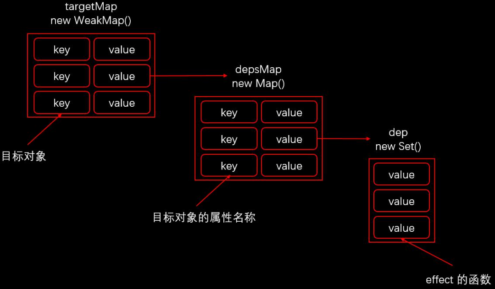

# 响应式

- proxy 对象实现属性监听
- 多层属性嵌套，在访问属性过程中处理下一级属性
- proxy不能监听基本属性的处理

模拟实现核心方法
- reactive/track/trigger
- ref/toRefs
- effect/computed

## 模拟实现 reactive

- 接收一个参数，判断这个参数是否是对象，如果不是就直接返回。`reactive`只能把对象转为响应式
- 创建拦截器对象`handle`，返回`proxy`对象

```js
/**
 * 判断是否是对象
 * @param {*} val
 * @returns
 */
const isObject = (val) => val !== null && typeof val === 'object'
/**
 * 判断是否是对象，如果是对象就调用reactive，如果不是就返回
 * @param {*} target
 * @returns
 */
const convert = (target) => (isObject(target) ? reactive(target) : target)

export function reactive(target) {
  if (!isObject(target)) return
  const handler = {
    get(target, key, receiver) {
      // 收集依赖
      console.log('get', key)
      const result = Reflect.get(target, key, receiver)
      // 判断获取的值，是否是对象
      return convert(result)
    },
    set(target, key, value, receiver) {
      // 获取旧值，判断新旧值是否想等
      const oldValue = Reflect.get(target, key, receiver)
      // 定义一个布尔类型的变量用来返回，proxy的set不返回会报错
      let result = true
      if (oldValue !== value) {
        result = Reflect.set(target, key, value, receiver)
        //触发更新
        console.log('set', key, value)
      }
      return result
    },
    deleteProperty(target, key) {
      // 用于接收，成员是否在对象中
      const hadKey = Reflect.has(target, key)
      // 用于接收 delete会返回一个布尔值
      const result = Reflect.deleteProperty(target, key)
      // 判断属性是否在对象上，并且是否删除成功，如果是，返回true
      if (hadKey && result) {
        //触发更新
        console.log('delete', key)
      }
      return result
    },
  }
  return new Proxy(target, handler)
}
```

测试如下

```html
<!DOCTYPE html>
<html lang="en">

<head>
  <meta charset="UTF-8">
  <meta http-equiv="X-UA-Compatible" content="IE=edge">
  <meta name="viewport" content="width=device-width, initial-scale=1.0">
  <title>Document</title>
</head>

<body>
  <script type="module">
    import { reactive } from './index.js'
    const obj = reactive({
      name: 'zs',
      age: 18,
    })
    obj.name = 'lisi'
    delete obj.age
    console.log(obj)
  </script>
</body>

</html>
```
输出结果是: 可以看到基础的代理成功了

```js
set name lisi
index.js:44 delete age
index.html:20 Proxy {name: 'lisi'}
```

## 收集依赖

在`get`中收集依赖，收集依赖是存储当前这个的属性和回调，而属性和对象有关。先看个图



我们首先会创建一个`weakMap`，这是一个弱引用的`map`在失去引用之后，可以被v8快速销毁。
在这个map中，key值是`target`对象，`value`是一个新的`map`，这时候第一个图到第二个图就完成了。
在这时候，我们会查看`depsMap`中有没有对应`key`值的依赖。如果没有，则设置这个`key`对应一个空的`set`
注意`set`集合中存储的元素不会重复。`set`中存储的是`effect`函数，这时候依赖收集就完成了。

- `effect`，恒庄村中访问响应式属性就会收集依赖

```js
// 记录的callback 用于track可返回的callback函数，
let activeEffect = null

export function effect(callback) {
  activeEffect = callback
  // 访问响应式对象属性，去收集依赖
  callback()
  // 收集依赖结束，赋值为null
  activeEffect = null
}

```

- track 收集依赖的核心函数

```js
// 全局的target弱引用map
let targetMap = new WeakMap()

/**
 * 收集依赖
 * @param {*} target
 * @param {*} key
 */
export function track(target, key) {
  // 判断activeEffect是否存储，如果没有就直接返回，说明不需要收集
  if (!activeEffect) return
  // 获取depsMap
  let depsMap = targetMap.get(target)
  // 如果没有找到的话，要给当前的目标对象创建一个 depsMap ，并且添加到 targetMap 中。
  if (!depsMap) {
    targetMap.set(target, (depsMap = new Map()))
  }
  // 去map中拿effect依赖的集合
  let dep = depsMap.get(key)
  // 如果没有找到当前属性的dep集合，创建一个空的set
  if (!dep) {
    depsMap.set(key, (dep = new Set()))
  }
  // 最后将当前effect存储到dep中
  dep.add(activeEffect)
}

```

最后别忘记在`get`中调用收集依赖

```js
get(target, key, receiver) {
    // 收集依赖
    track(target, key)
    // ...
  },
```

## trgger 触发更新

触发更新就很简单了，根据`target`拿到`depsMap`，根据`key`拿到`dep`，循环执行其中的`effect`

```js
export function trigger(target, key) {
  // 获取targetmaps中的depsmap
  const depsMap = targetMap.get(target)
  // 如果没有拿到直接返回
  if (!depsMap) return
  // 获取对应属性的effect依赖集合
  const dep = depsMap.get(key)
  // 如果存在dep则循环执行回调
  if (dep) {
    dep.forEach((effect) => {
      effect()
    })
  }
}
```
在`set`和`deleteProperty`中调用。尝试测试

```html
<!DOCTYPE html>
<html lang="en">

<head>
  <meta charset="UTF-8">
  <meta http-equiv="X-UA-Compatible" content="IE=edge">
  <meta name="viewport" content="width=device-width, initial-scale=1.0">
  <title>Document</title>
</head>

<body>
  <script type="module">
    import { reactive, effect } from './index.js'
    const product = reactive({
      name: 'iPhone',
      price: 5000,
      count: 3,
    })
    let total = 0
    effect(() => {
      total = product.price * product.count
    })
    console.log(total)

    product.price = 4000
    console.log(total)

    product.count = 1
    console.log(total)
  </script>
</body>

</html>
```
输出结果如下
```js
15000
12000
4000
```

## ref实现

`reactive`只能用来创建对象的响应式，如果是原始值，就需要另一个函数来创建

ref vs reactive

- ref可以吧基本数据类型数据，转成响应式数据
- ref返回的对象，重新赋值成对象也是响应式的
- reactive返回的对象，重新赋值丢失响应式
- reactive返回的对象不可以解构

```js
export function ref(raw) {
  // 判断 raw 是否是ref 创建的对象，如果是的话直接返回
  if (isObject(raw) && raw.__v_isRef) return

  // 判断是否是对象，是的话创建一个响应式对象，如果是原始值直接返回
  let value = convert(raw)

  const r = {
    // ref持有的属性，
    __v_isRef: true,
    // 获取value值
    get value() {
      // 对value值收集依赖
      track(r, 'value')
      // 返回value
      return value
    },
    set value(newValue) {
      // 判断新旧的值是否不相等
      if (newValue !== value) {
        // 这里要注意，要把 newValue 赋值给 raw，要把原来的 raw 替换掉
        // 且也要判断新值是否是对象
        raw = newValue
        value = convert(raw)
        // 触发更新
        trigger(r, 'value')
      }
    },
  }
  return r
}
```

调用一下

```html
<!DOCTYPE html>
<html lang="en">

<head>
  <meta charset="UTF-8">
  <meta http-equiv="X-UA-Compatible" content="IE=edge">
  <meta name="viewport" content="width=device-width, initial-scale=1.0">
  <title>Document</title>
</head>

<body>
  <script type="module">
    import { reactive, effect, ref } from './index.js'
    const price = ref(5000)
    const count = ref(3)

    let total = 0
    effect(() => {
      total = price.value * count.value
    })
    console.log(total)

    price.value = 4000
    console.log(total)

    count.value = 1
    console.log(total)
  </script>
</body>

</html>
```

## toRefs 

该方法用来解决组合式函数中，返回响应式对象解构后对象不响应的问题

```js
export function toRefs(proxy) {
  // 因为 proxy 这个参数，有可能是响应式数组，也有可能是响应式对象。
  const ret = proxy instanceof Array ? new Array(proxy.length) : {}

  //循环遍历所有属性，把每个属性都转换成类似于ref创建的对象
  for (const key in proxy) {
    ret[key] = toProxyRef(proxy, key)
  }
  return ret
}
/**
 * 响应式对象
 * @param {object} proxy 响应式对象
 * @param {strig} key 属性名称
 */
function toProxyRef(proxy, key) {
  const r = {
    __v_isRef: true,
    get value() {
      // 这里不需要在收集依赖了，因为在reactive中读取属性时，自动收集了依赖了。
      return proxy[key]
    },
    set value(newValue) {
      // 这里不需要在触发更新了，因为在reactive中设置属性时，设置了触发更新。
      proxy[key] = newValue
    },
  }
  return r
}
```

测试
```html
<!DOCTYPE html>
<html lang="en">

<head>
  <meta charset="UTF-8">
  <meta http-equiv="X-UA-Compatible" content="IE=edge">
  <meta name="viewport" content="width=device-width, initial-scale=1.0">
  <title>Document</title>
</head>

<body>
  <script type="module">
    import { reactive, effect, ref, toRefs } from './index.js'
    function useProduct() {
      const product = reactive({
        name: 'iPhone',
        price: 5000,
        count: 3
      })

      return toRefs(product)
    }

    const { price, count } = useProduct()


    let total = 0
    effect(() => {
      total = price.value * count.value
    })
    console.log(total)

    price.value = 4000
    console.log(total)

    count.value = 1
    console.log(total)
  </script>
</body>

</html>
```

## computed 

```js
export function computed(getter) {
  // 创建一个空的ref对象，它的value值是undefined
  const ret = ref()
  // 收集依赖，在effect中返回属性时，会去收集依赖
  // 当数据变化时，会重新执行effect函数
  effect(() => (ret.value = getter()))

  return ret
}
```

调试

```html
<!DOCTYPE html>
<html lang="en">

<head>
  <meta charset="UTF-8">
  <meta http-equiv="X-UA-Compatible" content="IE=edge">
  <meta name="viewport" content="width=device-width, initial-scale=1.0">
  <title>Document</title>
</head>

<body>
  <script type="module">
    import { reactive, effect, ref, toRefs, computed } from './index.js'

    const product = reactive({
      name: 'iPhone',
      price: 5000,
      count: 3
    })
    let total = computed(() => {
      return product.price * product.count
    })

    console.log(total.value)

    product.price = 4000
    console.log(total.value)

    product.count = 1
    console.log(total.value)
  </script>
</body>

</html>
```
