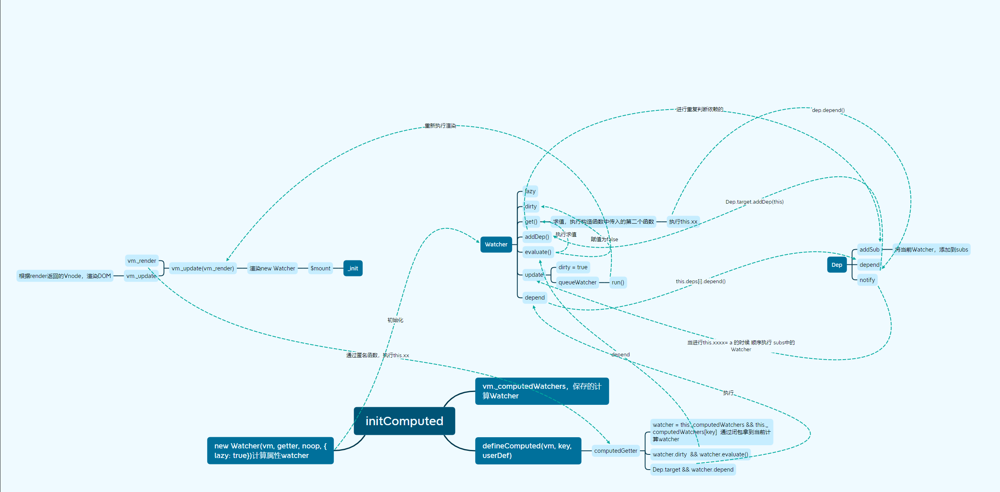

# 计算属性

关于计算属性，我们看官网文档的描述：

**计算属性是基于他们的响应式依赖进行缓存的，只在相关响应式依赖发生改变时它们才会重新求值**

那么如何解析这句话？我们从简单的例子开始

```html
<!DOCTYPE html>
<html lang="en">
<head>
  <meta charset="UTF-8">
  <meta http-equiv="X-UA-Compatible" content="IE=edge">
  <meta name="viewport" content="width=device-width, initial-scale=1.0">
  <title>computed</title>
  <script src="../../dist/vue.js"></script>
</head>
<body>
  <div id="app">
    <div>{{compA}}</div>
  </div>
  <script>
    const vm = new Vue({
      el: '#app',
      data: {
        a: 1,
      },
      computed: {
        compA() {
          return this.a + 1
        }
      }
    })
  </script>
</body>
</html>
```

查看源码，我们现在先分析首次执行，`computed`是如何做的。

## 首次执行

1. 初始化`computed`

在我们`new Vue`执行`_init`方法的时候，我们会执行到`initState`。这里是初始化大多数关键`options`的地方，并且会将其挂载到`$options`上，这样我们就能通过`this.$options`拿到

```js
export function initState (vm: Component) {
  //这个数组将用来存储所有该组件实例的 watcher 对象
  vm._watchers = []
  const opts = vm.$options
  if (opts.props) initProps(vm, opts.props)
  if (opts.methods) initMethods(vm, opts.methods)
  if (opts.data) {
    initData(vm)
  } else {
    // 不存在则观测空对象
    observe(vm._data = {}, true /* asRootData */)
  }
  if (opts.computed) initComputed(vm, opts.computed)
  if (opts.watch && opts.watch !== nativeWatch) {
    initWatch(vm, opts.watch)
  }
}
```

我们主要看 `initComputed`是如何执行的。

```js
function initComputed (vm: Component, computed: Object) {
  // $flow-disable-line
  // 创建原型为null的空对象 // 计算属性观察者列表
  const watchers = vm._computedWatchers = Object.create(null)
  // computed properties are just getters during SSR
  const isSSR = isServerRendering()

  /**
   * computed: {
        someComputedProp () {
        return this.a + this.b
      }
    }
   */
  for (const key in computed) {
    const userDef = computed[key]
    // 获取getter 对象写法和函数写法不同
    const getter = typeof userDef === 'function' ? userDef : userDef.get
    // 计算属性没有对应的getter
    if (process.env.NODE_ENV !== 'production' && getter == null) {
      warn(
        `Getter is missing for computed property "${key}".`,
        vm
      )
    }

    if (!isSSR) {
      // create internal watcher for the computed property.
      // 计算属性的观察者对象
      watchers[key] = new Watcher(
        vm,
        getter || noop,
        noop,
        computedWatcherOptions
      )
    }

    // component-defined computed properties are already defined on the
    // component prototype. We only need to define computed properties defined
    // at instantiation here.
    // 计算属性的 key不能在 props data中存在，同名问题，因为他也会被放到 vm下
    if (!(key in vm)) {
      defineComputed(vm, key, userDef)
    } else if (process.env.NODE_ENV !== 'production') {
      if (key in vm.$data) {
        warn(`The computed property "${key}" is already defined in data.`, vm)
      } else if (vm.$options.props && key in vm.$options.props) {
        warn(`The computed property "${key}" is already defined as a prop.`, vm)
      } else if (vm.$options.methods && key in vm.$options.methods) {
        warn(`The computed property "${key}" is already defined as a method.`, vm)
      }
    }
  }
}
```

上面写的非常清楚，整个代码分为三块内容

1. 创建一个`watchers = vm._computedWatchers = null`
2. 拿到`computed`内的方法，赋值给`getter`，然后`new Watcher`，并赋值给`watchers[key]`
3. 执行`defineComputed`方法，这里会判断`computed`的`key`在不在`vm`中，如果存在表示已定义会报错

好了解了这三步，我们就可以按步骤分析，第一步先不说。直接看第二步

### 创建一个计算属性Watcher

**为什么叫计算属性watcher?**

```js
watchers[key] = new Watcher(
  vm,
  getter || noop,
  noop,
  computedWatcherOptions
)
```

```js
export default class Watcher {
  constructor (
    vm: Component,
    // 求值表达式
    expOrFn: string | Function,
    // 回调
    cb: Function,
    // 选项
    options?: ?Object,
    // 是否是渲染watcher
    isRenderWatcher?: boolean
  ) {
    // options
    if (options) {
      this.deep = !!options.deep // 是否使用深度观测
      this.user = !!options.user // 用来标识当前观察者实例对象是 开发者定义的 还是 内部定义的
      this.lazy = !!options.lazy // 惰性watcher  第一次不请求
      this.sync = !!options.sync // 当数据变化的时候是否同步求值并执行回调
      this.before = options.before // 在触发更新之前的 调用回调
    } else {
      this.deep = this.user = this.lazy = this.sync = false
    }
    this.cb = cb // 回调
    this.id = ++uid // uid for batching 唯一标识
    this.active = true // 激活对象
    this.dirty = this.lazy // for lazy watchers
    // 实现避免重复依赖
    this.deps = []
    this.newDeps = []
    this.depIds = new Set()
    this.newDepIds = new Set()
    // parse expression for getter
    if (typeof expOrFn === 'function') {
      this.getter = expOrFn
    } else {
      // 处理表达式 obj.a
      this.getter = parsePath(expOrFn)
      if (!this.getter) {
        this.getter = noop
        // Watcher 只接受简单的点(.)分隔路径，如果你要用全部的 js 语法特性直接观察一个函数即可
        process.env.NODE_ENV !== 'production' && warn(
          `Failed watching path: "${expOrFn}" ` +
          'Watcher only accepts simple dot-delimited paths. ' +
          'For full control, use a function instead.',
          vm
        )
      }
    }
    // 当时计算属性 构造函数是不求值的
    this.value = this.lazy
      ? undefined
      : this.get()
  }
```

在`new Watcher`的时候它传递了四个参数，首先看第四个参数，`computedWatcherOptions`，它是一个`options`。我们看看这个东西是什么

```js
const computedWatcherOptions = { lazy: true }
```

将`lazy`赋值给`true`，然后在`watcher`构造函数中将`this.dirty = this.lazy = true`。它和在`mountComponent`定义的`Wacher`不同
具备不同的属性，所以用他的`options`命名，计算`Wacher`。

**注意**
我们可以看到，正因为他是`lazy = true`，所以首次执行，他不会进行求值，也就是不会执行。`this.get()`。即它自身，也就是我们例子的`comp`不参与`watcher`的求值。
留意一下**思考为什么要这么做**。

## defineComputed

好我们看下一个方法`defineComputed(vm, key, userDef)`，从方法名就能很清楚的知道，这个方法用来定义拦截器

```js
export function defineComputed (
  target: any,
  key: string,
  userDef: Object | Function
) {
  // 非服务端下计算属性杯缓存
  const shouldCache = !isServerRendering()
  if (typeof userDef === 'function') {
    // 浏览器端和服务端处理不同
    sharedPropertyDefinition.get = shouldCache
      ? createComputedGetter(key)
      : createGetterInvoker(userDef)
    sharedPropertyDefinition.set = noop
  } else {
    sharedPropertyDefinition.get = userDef.get
      ? shouldCache && userDef.cache !== false
        ? createComputedGetter(key)
        : createGetterInvoker(userDef.get)
      : noop
    sharedPropertyDefinition.set = userDef.set || noop
  }
  // 当计算属性没有设置set就不能为computed 赋值
  if (process.env.NODE_ENV !== 'production' &&
      sharedPropertyDefinition.set === noop) {
    sharedPropertyDefinition.set = function () {
      warn(
        `Computed property "${key}" was assigned to but it has no setter.`,
        this
      )
    }
  }
  Object.defineProperty(target, key, sharedPropertyDefinition)
}
```

这里我们只要看`sharedPropertyDefinition`用的是什么`get`和`set`就可以了。

1. 当`userDef`是一个方法时，在非服务端渲染环境下使用`createComputedGetter(userDef)`，并且`set`是一个空函数
2. 当`userDef`是一个对象时，使用`createComputedGetter(userDef.get)`，而`set`会执行赋值

我们看看`createComputedGetter`方法做了什么

```js
function createComputedGetter (key) {
  // 计算属性拦截器
  return function computedGetter () {
    const watcher = this._computedWatchers && this._computedWatchers[key]
    if (watcher) {
      // dirty = lazy = true
      // 执行了 this.get 对 计算属性里的方法的data值做了一次依赖
      // 求值运算 计算watcher
      if (watcher.dirty) {
        watcher.evaluate()
      }
      // 渲染watcher
      if (Dep.target) {
        watcher.depend()
      }
      return watcher.value
    }
  }
}
```

执行了`createComputedGetter(key)`方法，然后返回了`computedGetter`，我们定义的`get`是`computedGetter`方法，并且使用闭包，缓存了起来。
根据例子`defineComputed`执行后的效果是

```js
Object.defineProperty(vm, 'compA', {
  configurable: true,
  enumerable: true,
  get: computedGetter(),
  set: () => {},
})
```

我们在实例上，创建了一个对`compA`的拦截器。这样`initComputed`就结束了。

## 生成执行执行函数

这里我们不详细讨论了，因为这块要讲清楚非常长，简要流程就是，运行到渲染`Wacher`的创建的时候

```js
export function mountComponent (
  vm: Component,
  el: ?Element,
  hydrating?: boolean
): Component {
    ...
    updateComponent = () => {
       vm._update(vm._render(), hydrating)
     }
     ...
    new Watcher(vm, updateComponent, noop, {
     before () {
       if (vm._isMounted && !vm._isDestroyed) {
         callHook(vm, 'beforeUpdate')
       }
     }
    }, true /* isRenderWatcher */)
    return vm
}
```

这里`lazy`为`false`，所以构造函数初始化完成最后会执行`this.get()`

```js
get () {
 ... 
 value = this.getter.call(vm, vm)
 ...
 return value
}
```

不看其他代码，核心就是执行了`this.getter`，这个在构造函数中有赋值，就是`updateComponent`。
所以我们执行了`vm._update(vm._render(), hydrating)`。首先看`vm._render`方法，它定义在`render.js`中。
现在它的关键就两行代码。

```js
Vue.prototype._render = function (): VNode {
  const vm: Component = this
  // 通过规整化好后的 $options拿到 渲染函数
  const { render, _parentVnode } = vm.$options
 
  let vnode
  // 执行render.call(vm, 拿到用户输入或者编译生成的createElement函数)
  vnode = render.call(vm._renderProxy, vm.$createElement)
    
  return vnode
}
```

1. 从 `vm.$options` 中获取 `render`。
2. 执行`render`方法。并传入当前实例，和`vm.$createElement`，`vm.$createElement`是`initRender`时候定义的`createElement`

我们先来看看`render`是什么，这个要去`platforms/web/entry-runtime-with-compiler`下看。这是一个和环境相关的值

```js
// 缓存 runtime/index.js 中的 $mount 方法
const mount = Vue.prototype.$mount
// 重写 Vue.prototype.$mount 方法
Vue.prototype.$mount = function (
  el?: string | Element,
  hydrating?: boolean
): Component {
  // 获取挂载点的dom
  el = el && query(el)

  const options = this.$options
  // resolve template/el and convert to render function
  // 使用 template 或 el 选项构建渲染函数
  if (!options.render) {
    let template = options.template
    ... // 获取template的html， el得到的html会赋值给template
    // 可能存在template为空 拿到的数据为空
    if (template) {
      // 通过compileToFunction 生成 render 和 静态render
      const { render, staticRenderFns } = compileToFunctions(template, {
        outputSourceRange: process.env.NODE_ENV !== 'production',
        // 在模板编译的时候对属性的换行符做处理
        shouldDecodeNewlines,
        shouldDecodeNewlinesForHref,
        delimiters: options.delimiters,
        comments: options.comments
      }, this)
      options.render = render
      options.staticRenderFns = staticRenderFns
    }
  }
  // 调用mount
  return mount.call(this, el, hydrating)
}
```

这里我们拿到了`render`，并赋值给了`this.$options`。所以上面我们才可以拿到，我们再进去看`compileToFunctions`，层层向上找，我们来到了

```js
export const createCompiler = createCompilerCreator(function baseCompile (
  template: string,
  options: CompilerOptions
): CompiledResult {
  // 解析原始代码并生成AST
  const ast = parse(template.trim(), options)
  if (options.optimize !== false) {
    // 将ast中的不变代码 标识static
    optimize(ast, options)
  }
  // 根据给定的AST生成目标平台的代码
  const code = generate(ast, options)
  return {
    ast,
    render: code.render,
    staticRenderFns: code.staticRenderFns
  }
})
```

这里是解析`html`的核心，里面`vue`运用了函数柯里化的方法将解析和一些错误判断进行了隔离，我们在`code`之后打个`debugger`。直接看`template`的最终生成

```js
with(this){
  return _c('div',{attrs:{\"id\":\"app\"}},[_c('div',[_v(_s(compA))])])
}
```

这是我们例子的代码`code`字符串，之后通过`new Function(code)`就拿到了一个匿名函数

```js
;(function anonymous () {
  with (this) {
    return _c('div', { attrs: { id: 'app' } }, [_c('div', [_v(_s(compA))])])
  }
})
```

## 执行匿名函数

这里注意一下，在开发环境`vm._renderProxy`是一个`proxy`代理，或者`vm`。在正式环境它就是`vm`。

```js
// Vue.prototype._init方法中
/* istanbul ignore else */
 if (process.env.NODE_ENV !== 'production') {
   // 设置渲染函数的作用域代理，其目的是为我们提供更好的提示信息
   initProxy(vm)
 } else {
   // 在生产环境中通过，vue-loader 编译后的template 是不 使用 with 语句包裹的 js代码，
   // 所以不需要proxy 的has 去代理 with中的 属性
   vm._renderProxy = vm
 }
```

好那么现在我们开始执行，首先我们先来了解一下`_c、_v、_s`分别是什么。`_c`我们可以在`initRender`中看到，它就是`createElement`返回一个Vnode。
其他我们可以在`instance/render-helpers/index.js`中看到。

```js
// 返回Vnode
_c = createElement(vm, a, b, c, d, false)
// 创建一个空节点
_v = createTextVNode
// 转为字符串
_s = toString
```

我们主要看 `toString`的执行中`compA`的执行，也就是我们运行了`this['compA']`。因为上面定义了拦截器，所以我们会执行到`computedGetter`。

## 开始真正的computed执行

### 执行 watcher.evaluate()

因为我们缓存了之前的`key`，所以们在当前实例下面，拿到了之前`new`的计算`Watcher`。第一次，我们执行`watcher.evaluate()`注意这时候的`watcher`是计算`watcher`。

```js
return function computedGetter () {
 const watcher = this._computedWatchers && this._computedWatchers[key]
 if (watcher) {
   // dirty = lazy = true
   // 执行了 this.get 对 计算属性里的方法的data值做了一次依赖
   if (watcher.dirty) {
     watcher.evaluate()
   }
   if (Dep.target) {
     watcher.depend()
   }
   return watcher.value
 }
}
```

这时候我们执行了`this.get()`。从上面分析可知，执行`this.get()`就是执行`this.getter`，也就是初始化传入的求值表达式，`computed`的求值表达式是

```js
evaluate () {
 this.value = this.get()
 this.dirty = false
}
```

可以清晰的看到，这时候我们触发了`this.a`。根据响应式原理，这里我们将触发`data`中早已定义好的拦截器`get`。进行响应式依赖的收集，将我们的计算`Watcher`, 放到了`dep.subs`中。
这里我不详细说明`data`的响应式收集过程了。等下一篇文章关于`data`再分析。我们只要知道`a`的`dep`数组中存放了计算`Watcher`。然后把 `dirty = false`。`watcher.evaluate()`执行完成。

```js
function () {
 return this.a + 1
}
```

### 执行 watcher.depend()

执行`watcher.depend()`之前，我们想一想`Dep.target`是什么？

首先我们要明确一点，它是一个全局属性，在初始化中指向当前`Watcher`。**现在我们执行的是整个`vue`的初始化，它有且仅有一个`Watcher`，渲染`Watcher`**

**那为什么他会变成当前的渲染`watcher`？** 这里我们要回过头来看看，上面执行的`this.get()`。看代码

```js
get () {
  // 给Dep.target 赋值 Watcher
  pushTarget(this)

  // 清除当前 target
  popTarget()
 
 }
 return value
}
// observer/dep.js
Dep.target = null
const targetStack = []

export function pushTarget (target: ?Watcher) {
  targetStack.push(target)
  Dep.target = target
}

export function popTarget () {
  targetStack.pop()
  Dep.target = targetStack[targetStack.length - 1]
}
```

首先我们全局维护了`targetStack`和`Dep.target`。在我们初始化`vue`如果不存在`computed`，我们的`Dep.target`就指向渲染`Watcher`。`targetStack`也保存着它。
但是在执行`watcher.evaluate()`的时候，我们用的是保存在`this._computedWatchers`中的计算`Watcher`。这时候通过第一个方法，我们`push`到了`targetStack`，但是在求值完成之后，
我们`popTarget`了当前的`Watcher`。这时候，当前的`Watcher`就变成了渲染`Watcher`。

好明白这一点，我们执行`watcher.depend()`。

```js
depend () {
 let i = this.deps.length
 while (i--) {
   this.deps[i].depend()
 }
}
```

这个`this.deps`我们保存着计算`Watcher`。它的长度为1，好我们再次执行了依赖收集，但是当前`Watcher`是渲染`watcher`。这个上面已经分析过了，在执行完成依赖收集之后我们可以看到
当前的`a`中的`Dep`实例下的`subs`数组中保存了两个`Watcher`。

```js
{
  id: 3,
  subs: [
    Watcher, // 计算 Watcher
    Watcher // 渲染 Watcher
  ]
}
```

之后我们返回了`watcher.value`，也就是计算`Watcher`求值之后的值，之后就是`vm._update`的执行，将`vnode`渲染到页面上。首次渲染完成

## 来思考一些问题

1. 基于响应式的缓存是如何实现的

我们看一个例子

```html{13}
<!DOCTYPE html>
<html lang="en">
<head>
  <meta charset="UTF-8">
  <meta http-equiv="X-UA-Compatible" content="IE=edge">
  <meta name="viewport" content="width=device-width, initial-scale=1.0">
  <title>computed</title>
  <script src="../../dist/vue.js"></script>
</head>
<body>
  <div id="app">
    <div>{{compA}}</div>
    <div>{{compA}}</div>
  </div>
  <script>
    const vm = new Vue({
      el: '#app',
      data: {
        a: 1,
      },
      computed: {
        compA() {
          return this.a + 1
        }
      }
    })
  </script>
</body>
</html>
```

对我们再次放了一个`compA`上去，第二次执行`this['compA']`有什么不同?

首先我们清楚一点在计算`Watcher`中，我们定义了两个属性`dirty=lazy=true`。但是在第一次求值过程中我们将`dirty`赋值为了`false`。

```js
evaluate () {
 this.value = this.get()
 this.dirty = false
}
if (watcher.dirty) {
  watcher.evaluate()
}
```

因此我们在第二次执行的时候，`watcher.dirty`为`false`，所以他不会执行。这就是闭包的好处。而执行`watcher.depend`的是时候，它的重复收集和`addDep`方法相关

```js
addDep (dep: Dep) {
 const id = dep.id
 // * 在一次求值中 查看这个唯一id 是否在set中已存在，
 if (!this.newDepIds.has(id)) {
 }
}
```

这里会判断`this.newDepIds`中是否存在当前的依赖`id`，同一个显然是相当的，所以直接返回。这就是缓存的实现。关于这块的去重问题，等之后响应式`data`的解析吧。

## 更新数据

**只在相关响应式依赖发生改变时它们才会重新求值**

好明白这个，我们再来看后半句，我们试着更新一下`a`的值，看看发生什么，在`console`中执行`vm.a = 3`。
这时候我们触发了`data`拦截器中`set`函数的`dep.notify()`方法。

```js
notify () {
 // stabilize the subscriber list first
 const subs = this.subs.slice()
 for (let i = 0, l = subs.length; i < l; i++) {
   // 循环执行所有的 观察者对象
   subs[i].update()
 }
}
```

从上面可以看出，我们顺序执行`Watcher`的`update`方法。来看看`update`方法的实现

```js{3-4}
update () {
 // 计算属性值是不参与更新的
 if (this.lazy) {
   this.dirty = true
   // 是否同步更新变化
 } else if (this.sync) {
   this.run()
 } else {
   // 将当前观察者对象放到一个异步更新队列
   queueWatcher(this)
 }
}
```

从上面我们知道，第一个`Watcher`是计算`Watcher`，所以它的`lazy`是`true`，在这个代码段中，只执行了
`this.dirty=true`，**为什么要执行这一步，结合第一次赋值为`false`想一想**。好我这里先卖个关子。

然后我们看第二个渲染`Watcher`的执行，这时候`lazy`不为`true`了，我们执行到了`queueWatcher`。在这个方法中，首先存了一个`watcher`队列，并且把队列放到了`nextTick`中执行，也就是放到了下一次事件循环之前的
微任务中，然后在`flushSchedulerQueue`方法中会执行到`watcher.run`，之后进行再次求值。更新值，更新
`DOM`

上面内容不细说，等到分析`nextTick`再看。

我们先来看上面的问题

为什么要给`this.dirty`赋值为`true`?

要解答这个问题，我们先来看最新的例子的匿名执行代码

```js
;(function anonymous () {
  with (this) {
    return _c('div', { attrs: { id: 'app' } }, [
      _c('div', [_v(_s(compA))]),
      _v(' '),
      _c('div', [_v(_s(compA))])
    ])
  }
})
```

可以发现我们执行了两次`this['compA']`，那么整体流程就显而易见了

第一次执行`this['compA']`
`dep.notify-->dep.update-->queueWatcher-->watcher.run-->this.getter`。
上面在第一个计算`Watcher`中我们赋值了`this.dirty = true`。然后执行了渲染函数中的`vm._update(vm._render)`。也就是执行上面的匿名函数

这时候会触发`computedGetter`，但是我们的`dirty`为`true`，所以首次我们会对计算属性进行重新求值。但是这时候我们也重新进行了依赖添加呀？观察以下代码

```js
addDep (dep: Dep) {
 const id = dep.id
 // * 在一次求值中 查看这个唯一id 是否在set中已存在，
 if (!this.newDepIds.has(id)) {
   // 不存在就放进 set里面 然后吧 dep也放到 newdeps里
   // 每次重新求值， newDepIds 都会被清空
   this.newDepIds.add(id)
   this.newDeps.push(dep)
   // * 在 多次求值 中避免收集重复依赖的
   if (!this.depIds.has(id)) {
     dep.addSub(this)
   }
 }
}
```

`depIds`保存的是上一次的依赖，每一个`Dep`都会存有一个唯一的`id`，计算的值没变，所以上一次和这一次是一致的。依赖不会保存。这里仍旧和`data`的初始化相关。

然后第二个`this['compA']`进来就和初始化一样了。

## 总结

这样我们就彻底解析了`computed`的核心实现，也解答了官网的话。如果是增加依赖执行也并无不同。最后再来看一下整个流程图


