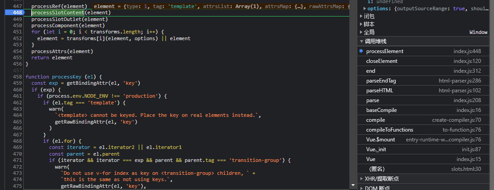

# 插槽

`slots`是`vue`的一个核心功能，它和`keep-alive、transition`组件都有关系，所以我们有必要对它做一个全面的了解。

```html
<div id="app">
  <app-layout>
    <template v-slot:header>头部内容</template>
    <template v-slot>默认内容</template>
    <template v-slot:footer>底部内容</template>
  </app-layout>
  <button @click="change">change title</button>
</div>
<script>
  const AppLayout = {
    template:
      '<div class="container">' +
      '<header><slot name="header"></slot></header>' +
      '<main><slot></slot></main>' +
      '<footer><slot name="footer"></slot></footer>' +
      '</div>'
  }

  const vm = new Vue({
    el: '#app',
    components: {
      AppLayout
    }
  })
</script>
```

因为`vue-next`已经全面改成使用`v-slot`了，所以我们分析插槽只分析`v-slot API`。

**注意**
当我们开始分析`vue`的指令的时候，我们需要分两步走：

1. 编译阶段做了哪些工作，`AST`和`render`方法是什么样子的？
2. 初始化做了什么工作，执行的时候又做了什么？

## 插槽的编译


`vue`的编译分为三步

1. `parse`：将`html`转换成`AST`树
2. `opitimize`: 将`AST`中不变的数据标识成`static`，优化的作用
3. `codegen`: 将`AST`代码转成字符串，并通过`new Function`实例化为函数

### parse

那么我们先看第一步，在`parse`方法里面`vue`调用了`parseHTML`方法。`parseHTML`方法传入两个参数，一个是`html`字符串，
在第二个参数里面传入了四个钩子函数`start、end、chars、comment`，这里要讲清楚的话比较麻烦，而我们通过查看执行栈的方式来看`parse`的执行过程。

首先我们知道我们现在的例子和`slot`有关，那么很显然`vue`在定义方法的时候肯定和`slot`有关系，我们查找到两个方法`processSlotContent`和`processSlotOutlet`两个方法。
在第一个方法打上断点，查看执行栈



这样就能清晰的看到代码的执行过程了。这里我们进入`processSlotContent`方法，开始分析

```js
function processSlotContent (el) {
  // 2.6 v-slot syntax
  if (process.env.NEW_SLOT_SYNTAX) {
    if (el.tag === 'template') {
      // v-slot on <template>
      const slotBinding = getAndRemoveAttrByRegex(el, slotRE)
      if (slotBinding) {
        const { name, dynamic } = getSlotName(slotBinding)
        el.slotTarget = name
        el.slotTargetDynamic = dynamic
        el.slotScope = slotBinding.value || emptySlotScopeToken 
      }
    }
  }
}
```
这里我们先记录一下，`el`当前的对象中`attrsList`的值

```js
el: {
  attrsList: [{
    end: 68,
    name: "v-slot:header",
    start: 52,
    value: ""
  }]
}
```
然后直接跳过`getAndRemoveAttrByRegex`方法查看新值和返回值，`attrsList`被清空了，并且我们拿到了里面的值
```js
{
 end: 68,
 name: "v-slot:header",
 start: 52,
 value: ""
}
```
`getSlotName`方法拿到`name`值，这个值是`header`。并且这里也会判断是不是动态`slot`和新增特性相关。
最后`vue`赋值了三个属性

```js
slotScope: "_empty_"
slotTarget: "\"header\""
slotTargetDynamic: false
```
这里我们还要去`closeElement`方法看一下

```js
function closeElement (element) {

 if (!inVPre && !element.processed) {
   element = processElement(element, options)
 }
 if (currentParent && !element.forbidden) {
   if (element.elseif || element.else) {
     ...
   } else {
     if (element.slotScope) {
       const name = element.slotTarget || '"default"'
       ;(currentParent.scopedSlots || (currentParent.scopedSlots = {}))[name] = element
     }
     currentParent.children.push(element)
     element.parent = currentParent
   }
 }

 element.children = element.children.filter(c => !c.slotScope)
}
```
在执行完`processElement`之后，我们看上面的代码，`currentParent`在`start`钩子函数中赋值，拿到是当前的`element`的父级。

这里我们看到将当前`element`元素放到了`currentParent`的`scopedSlots`和`children`。

**为什么要在`scopedSlots`中也放一份？**

为了正确维护`v-if`的关系，看下面这段代码，过滤`slotScope`中不存在的数据

```js
element.children = element.children.filter(c => !c.slotScope)
```

这样父组件内的第一个`v-slot`就解析完毕了。


好，我们看最终生成的`AST`，父组件是这样的

```js
const ast = {
  children: [
    {
      tag: "app-layout",
      scopedSlots: {
        'default': {slotTarget: '"default"', slotScope: '_empty_', parent: 'parentAST'},
        'footer': {slotTarget: '"footer"', slotScope: '_empty_', parent: 'parentAST'},
        'header': {slotTarget: '"header"', slotScope: '_empty_', parent: 'parentAST'},
      }
    }
  ]
}
```
**什么时候进入子组件？**

只要看`el.tag`是否是`app-layout`就行。好，开始执行子组件解析的时候，我们进入`processSlotOutlet`

```js
function processSlotOutlet (el) {
  if (el.tag === 'slot') {
    el.slotName = getBindingAttr(el, 'name')
  }
}
```
这里主要是赋值了`slotName`。这个就很简单，我们直接看子组件的`AST`

```js
const childAst = {
  children: [
    {
      tag: 'header',
      children: [{slotName:'header', tag:'slot'}]
    }
    ...
  ]
}
```

### codegen

拿到`AST`之后，我们就需要将它转换成字符串代码，在`src/compiler/index.js`文件中，我们可以看到
`vue`编译的三个步骤，那么我们现在就来看看`generate(ast, options)`。在该方法中，我们可以看到，
主要分两步

1. 初始化`options`，拿到`state`
2. 通过`genElement`拿到`code`

我们直接看`genElement`，对于父组件，我们看其中的`genData`。

```js
export function genData (el: ASTElement, state: CodegenState): string {
  let data = '{'
  if (el.scopedSlots) {
    data += `${genScopedSlots(el, el.scopedSlots, state)},`
  }
  return data
}
```
看上面父组件的`AST`，我们要拿到`children`才会走上面的逻辑，所以直接跳到子`el`。进入`genScopedSlots`。

```js
function genScopedSlots (
  el: ASTElement,
  slots: { [key: string]: ASTElement },
  state: CodegenState
): string {

  // 优化的代码，先去掉

  const generatedSlots = Object.keys(slots)
    .map(key => genScopedSlot(slots[key], state))
    .join(',')

  return `scopedSlots:_u([${generatedSlots}]${
    needsForceUpdate ? `,null,true` : ``
  }${
    !needsForceUpdate && needsKey ? `,null,false,${hash(generatedSlots)}` : ``
  })`
}
```
前面是关于在`v-slots`中使用`v-if`的优化。`genScopedSlot`就是每一个`v-slot`生成的过程，里面就不进去看了，也是很简单的判断和字符串拼接，我们直接看结果。

```js
{scopedSlots:_u([
  {key:"header",fn:function(){return [_v("头部内容")]},proxy:true},
  {key:"default",fn:function(){return [_v("默认内容")]},proxy:true},
  {key:"footer",fn:function(){return [_v("底部内容")]},proxy:true}])
}
```
父组件返回的字符串结果如图，我们看子组件。在子组件中，它的`AST`关键在于`el.tag=slot`
所以我们看的是
```js
export function genElement (el: ASTElement, state: CodegenState): string {
  if (el.parent) {
    el.pre = el.pre || el.parent.pre
  } else if (el.tag === 'slot') {
    return genSlot(el, state)
  }
  return code
}
```
所以我们就可以拿到它的`code`

```js
_c('div',{staticClass:"container"},
[_c('header',[_t("header")],2),
_c('main',[_t("default")],2),
_c('footer',[_t("footer")],2)]
```

## 执行

编译阶段结束，那么我们就能拿到匿名执行函数去执行，在之前的文章我曾经说过，我们在执行匿名函数的时候，其实就是在执行`render-helpers`里面定义的方法，那么`_u`就是`resolveScopedSlots`方法

```js
export function resolveScopedSlots (
  fns: ScopedSlotsData, // see flow/vnode
  res?: Object,
  // the following are added in 2.6
  hasDynamicKeys?: boolean,
  contentHashKey?: number
): { [key: string]: Function, $stable: boolean } {
  res = res || { $stable: !hasDynamicKeys }
  for (let i = 0; i < fns.length; i++) {
    const slot = fns[i]
    if (Array.isArray(slot)) {
      resolveScopedSlots(slot, res, hasDynamicKeys)
    } else if (slot) {
      if (slot.proxy) {
        slot.fn.proxy = true
      }
      // 规整化为 插槽名称：fn
      res[slot.key] = slot.fn
    }
  }
  if (contentHashKey) {
    res.$key = contentHashKey
  }
  return res
}
```
看这个方法，`fns`就是我们上面通过`_u([...])`传入的数组，并且`vue`给`slots.fn.proxy=true`。最终的返回是
```js
res: {
  default: fn(),
  footer:fn(),
  header: fn(),
}
```

父组件处理完了，我们看子组件。看上面`vue`调用的`_t`方法。在`render-helpers`中是`renderSlot`方法，

```js
export function renderSlot (
  name: string,
  fallbackRender: ?((() => Array<VNode>) | Array<VNode>),
  props: ?Object,
  bindObject: ?Object
): ?Array<VNode> {
  const scopedSlotFn = this.$scopedSlots[name]
  let nodes
  if (scopedSlotFn) {
    // scoped slot
    props = props || {}
    nodes =
      scopedSlotFn(props) ||
      (typeof fallbackRender === 'function' ? fallbackRender() : fallbackRender)
  } 
  return nodes
}
```
唉，我们这里看到`this.$scopedSlots`里面好像存着，父组件上面解析好的`slots`这是为什么，哪里赋值的呢？

我们回过头来看一段代码，在`Vue.prototype._render`方法中

```js
Vue.prototype._render = function (): VNode {
    const vm: Component = this
    // 通过规整化好后的 $options拿到 渲染函数
    const { render, _parentVnode } = vm.$options
    // 拿到$scopeSlots
    if (_parentVnode) {
      vm.$scopedSlots = normalizeScopedSlots(
        _parentVnode.data.scopedSlots,
        vm.$slots,
        vm.$scopedSlots
      )
    }
    return vnode
  }
```

在子组件中`_parentVnode`是肯定存在的，那么就会调用`normalizeScopedSlots`，它传的第一个参数就是父组件上的`scopedSlots`对象，那么很显然，当前的`scopedSlots`也就有值了。

回过头去看上面的方法，`scopedSlotFn`存在值，那么就被执行了，执行的是`return [_v("头部内容")]`。因为`props`不存在值，那么直接的就返回了`nodes`。这样插槽就会被渲染到子组件了

## 作用域插槽

先看例子

```html
<div id="app">
 <app-layout>
   <template v-slot:header="props">头部内容 {{props.msg}}</template>
   <template v-slot="props">默认内容 {{props.msg}}</template>
   <template v-slot:footer="props">底部内容 {{props.msg}}</template>
 </app-layout>
</div>
<script>
 const AppLayout = {
   data() {
     return {
       msg1: 'header',
       msg2: 'default',
       msg3: 'footer'
     }
   },
   template:
     '<div class="container">' +
     '<header><slot name="header" :msg="msg1"></slot></header>' +
     '<main><slot :msg="msg2"></slot></main>' +
     '<footer><slot name="footer" :msg="msg3"></slot></footer>' +
     '</div>'
 }

 const vm = new Vue({
   el: '#app',
   components: {
     AppLayout
   }
 })
</script>
```
例子很简单，这次我们不一步步分析了，直接来看父组件和子组件的最终`code`

```js
scopedSlots:_u([
  {key:"header",fn:function(props){return [_v("头部内容 "+_s(props.msg))]}},{key:"default",fn:function(props){return [_v("默认内容 "+_s(props.msg))]}},{key:"footer",fn:function(props){return [_v("底部内容 "+_s(props.msg))]}}
])
```
不同点在于，方法中传了参数，并且调用了`_s`。

再看子组件

```js
[_c('header',[_t("header",null,{"msg":msg1})],2),
_c('main',[_t("default",null,{"msg":msg2})],2),
_c('footer',[_t("footer",null,{"msg":msg3})],2)]
```
这里我们传入了多个参数，那么很简单，我们去看`resolveScopedSlots`和`renderSlot`方法。
前者没什么不同，还是把数组形式转换成了对象形式。看`renderSlot`方法。

```js
nodes = scopedSlotFn(props)
```

那么再来看子组件，首先在运行到`msg1`的时候，`vue`会触发依赖收集，这都是在子组件进行的。然后触发`_t`
这时候我们可以看到通过`get`拦截器`vue`拿到了值`_t('footer', null, {msg: 'header'})`。那么在方法中，就能正确的渲染`props.msg`。

因为上面的依赖收集，当我们修改`msg1`的时候，就会触发子组件更新，这时候就会重新调用`_t`执行一遍


## 总结

插槽就是一段函数，可以看到，父组件里面的模板是父级作用域编译的，子组件通过拿到`scopedSlots`执行里面的方法，然后在子组件生成`vnode`渲染了真实`dom`。那么也就是官网中的话

**父级模板里的所有内容都是在父级作用域中编译的；子模板里的所有内容都是在子作用域中编译的**

