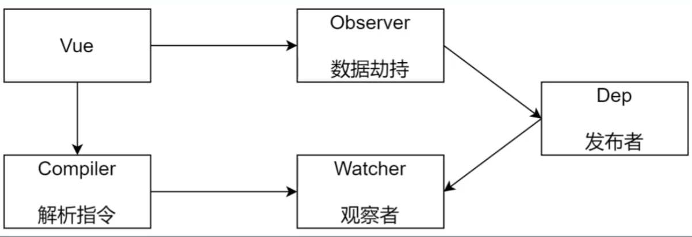

# vue响应式原理模拟

1. 数据驱动
2. 响应式原理
3. 发布订阅模式和观察者模式

## 数据驱动

1. 数据响应式、双向绑定、数据驱动
2. 数据响应式
   1. 数据模型仅仅是普通的js对象，而当我们修改数据时，视图会进行更新，避免了繁琐的DOM操作，提高开发效率
3. 双向绑定
   1. 数据改变，视图改变；视图改变、数据也随之改变
   2. 我们可以使用v-model在表带元素上创建双向绑定数据
4. 数据驱动是Vue最独特的特性之一
   1. 开发过程中仅需要关注数据本身，不需要关心数据如何渲染到视图


## 前置知识

- 两大模式


### 发布/订阅模式
- 由统一调度中心调用，因此发布者和订阅者不需要知道对方的存在

```js
class EventEmitter {
  constructor() {
    this.subs = Object.create(null) // 不需要原型链
  }

  // v注册事件
  $on(eventType, handler) {
    // 如果有值直接返回，如果没有值返回空数组
    this.subs[eventType] = this.subs[eventType] || []
    this.subs[eventType].push(handler)
  }

  // 触发事件
  $emit(eventType) {
    if (this.subs[eventType]) {
      this.subs[eventType].forEach((handler) => {
        handler()
      })
    }
  }
}

```

### 观察者模式
- 由具体目标调用，比如当事件触发，dep就会去调用观察者方法，所以观察者模式的订阅者和发布者之间存在依赖关系

```js
// 发布者-目标
class Dep {
  constructor() {
    // 记录所有的订阅者
    this.subs = []
  }
  // 添加订阅者
  addSub(sub) {
    if (subs && sub.update) {
      this.subs.push(sub)
    }
  }
  // 发布通知
  notify() {
    this.subs.forEach((sub) => {
      sub.update()
    })
  }
}

// 订阅者-观察者
class Watcher {
  update() {
    console.log('update')
  }
}

// test
let dep = new Dep()

let watcher = new Watcher()

dep.addSub(watcher)

dep.notify()

```

## 整体结构




## 实现

- 功能
  - 负责接收初始化的参数
  - 吧data中的属性注入到vue实例中，转换成getter/setter
  - 负责调用observer监听data中的所有属性变化
  - 负责调用compiler解析指令和差值表达式

<<< @/docs/vue/reactive/js/minivue.js

### observer.js

- 功能
  - 负责把data选项中的属性转换成响应式数据
  - data中的某个属性也是对象，把该属性转换成响应式数据
  - 数据变化发送通知


<<< @/docs/vue/reactive/js/observer.js

### compiler

- 功能
  - 负责编译模板，解析指令和差值表达式
  - 负责页面的首次渲染
  - 当数据变化后重新渲染视图

<<< @/docs/vue/reactive/js/compiler.js

### Dep
- 功能
  - 依赖收集、添加观察者
  - 通知所有观察者


<<< @/docs/vue/reactive/js/Dep.js


### watcher

- 功能
  - 当数据变化触发依赖，dep通知所有的watcher实例更新试图
  - 自身实例化的时候往dep对象中添加自己


<<< @/docs/vue/reactive/js/watcher.js

### 整体流程

1. 一个是第一次执行的时候，通过`new vue`将`data`中的数据通过响应式放到vue实例下(为了实现`this.xxx`的调用)，然后调用`observer`将`data`中的所有数据递归橙响应式数据，在该`get`和`set`中放好收集依赖和发送通知的功能，最后调用`compiler`解析指令
2. 在使用`this.xxx`触发`set`的时候会触发`observer`中的`dep.notify`，这个`notify`会触发`watcher`中的`update`方法，执行在`compiler`中写好的回调


