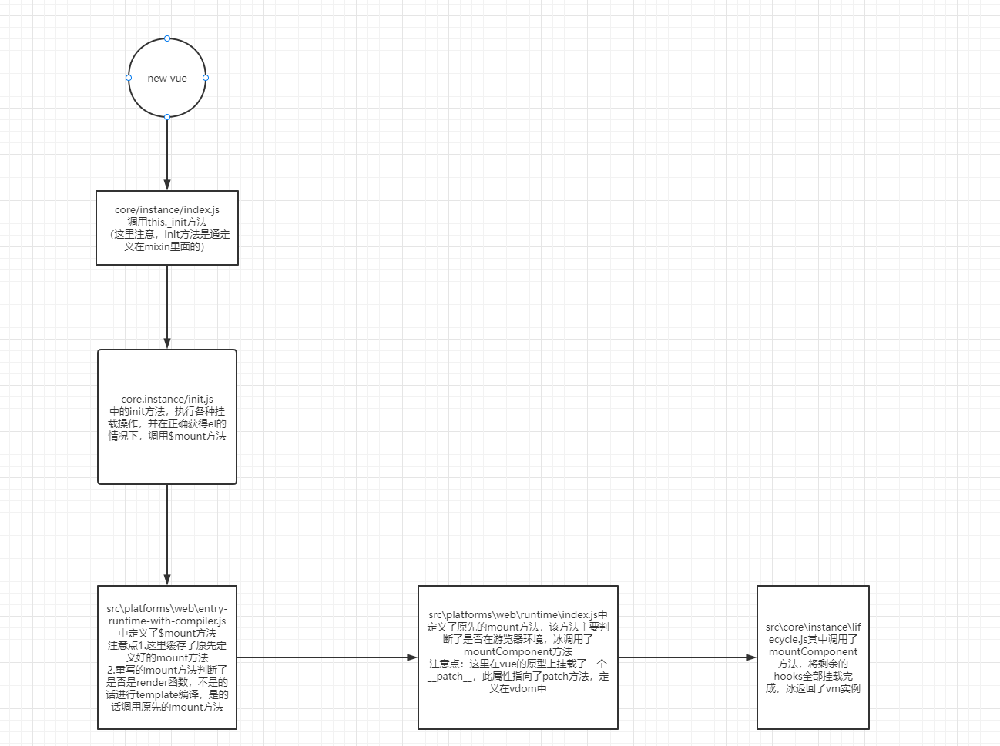

# vue不同版本的介绍

1. 完整版：包含编译器和运行时版本
2. 编译器：用来将模板字符串编译成js渲染函数的代码
3. 运行时：用来创建vue实例、渲染并处理 虚拟dom的代码；除去编译器版本
4. umd：通用版本，vue.js默认文件就是运行时+编译器的umd版本
5. cjs：太老了不推荐
6. es Module：可被静态分析，可以被打包工具用来tree-shaking并将不用的代码排除出去

# 从入口开始

